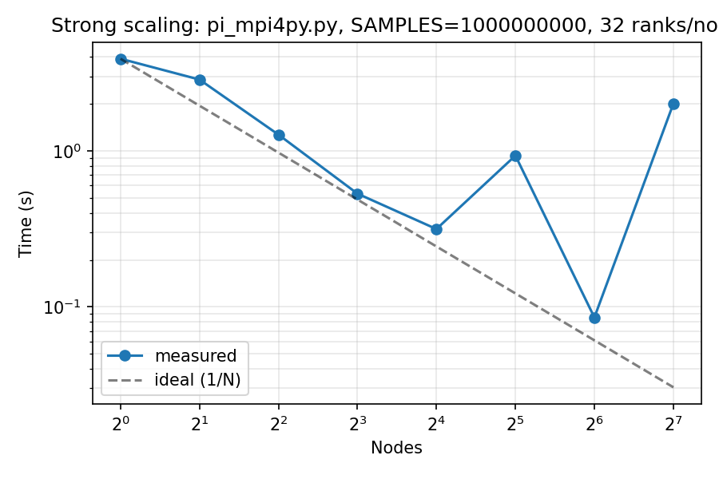
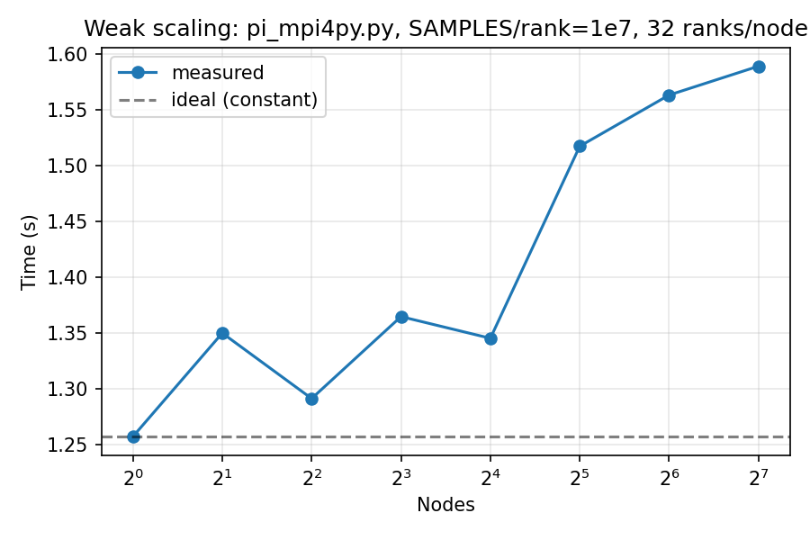
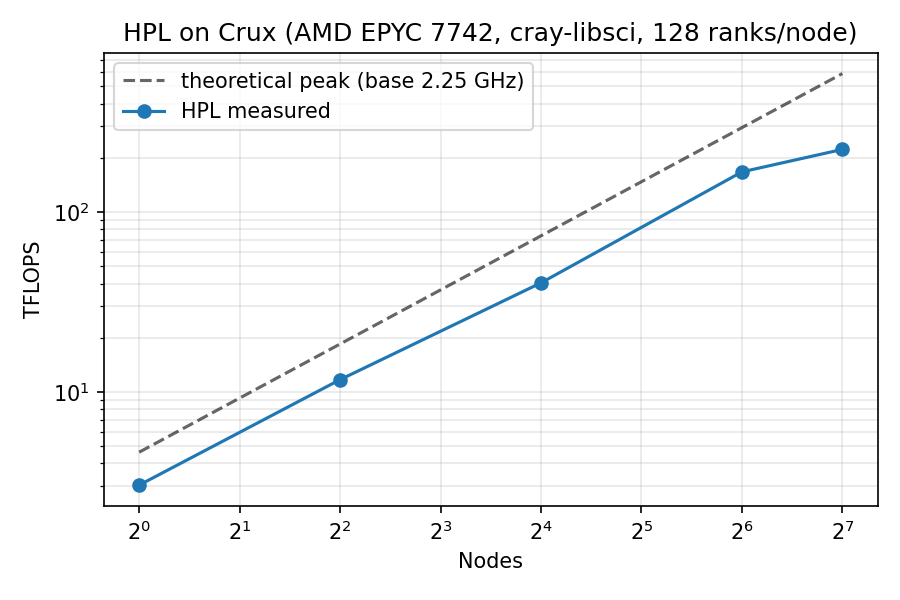

# Project 01 — Performance Measurements of Crux

**Author:** Huihuo Zheng (huihuo.zheng@anl.gov)
**Date:** 2026-05-01
**System:** ALCF Crux — 256 × 2× AMD EPYC 7742 (Rome), 128 cores / node, 256 GB / node
**Account / Queue:** DLIO / workq

This report covers Part I (MPI π Monte Carlo strong + weak scaling, 1–128 nodes,
32 ranks/node) and Part II (HPL FLOPs measurement on 1, 4, 16, 64, 128 nodes).
All jobs were submitted through the ALCF IRI `submit_job` API; job folders
live at `jobs/crux/04_proj01_pi/` and `jobs/crux/04_proj01_hpl/` in the
agentic_workflows repo.

---

## Part I — MPI π Scaling Study

### `qsub.sc` (single script reused for all 8 node counts)

The script auto-detects `NUM_NODES` from `$PBS_NODEFILE`, sets
`RANKS = NUM_NODES × 32`, and runs both the strong-scaling point
(`SAMPLES = 1×10⁹` fixed) and the weak-scaling point
(`SAMPLES_PER_RANK = 1×10⁷` constant) inside the same allocation.

```bash
#!/bin/bash -l
# Project 01 Part I: MPI pi scaling on Crux
# Usage:
#   qsub -l select=1   qsub.sc
#   qsub -l select=2   qsub.sc
#   ...
#   qsub -l select=128 qsub.sc
#
# Same script for every node count -- auto-detects nodes from $PBS_NODEFILE
# and runs both the strong-scaling point (fixed global SAMPLES) and the
# weak-scaling point (fixed SAMPLES_PER_RANK) in a single job.
#
#PBS -A DLIO
#PBS -l select=1
#PBS -l walltime=00:30:00
#PBS -N mpi_pi_scaling
#PBS -l filesystems=eagle:home
#PBS -j oe
#PBS -q workq

cd "${PBS_O_WORKDIR:-/eagle/datascience/hzheng/jobs/crux/04_proj01_pi}"

# IRI invokes us via `/bin/bash qsub.sc`, which ignores the #!/bin/bash -l
# shebang; need to bring in lmod + cray-mpich (mpiexec) explicitly.
source /etc/profile 2>/dev/null || true
source /etc/profile.d/z00-lmod.sh 2>/dev/null || \
    source /usr/share/lmod/lmod/init/bash 2>/dev/null || true
module load cray-mpich 2>&1 | head -5

# Conda Python with mpi4py -- shipped on Crux Eagle
source /eagle/datasets/soft/crux/miniconda3.sh

which mpiexec || { echo "mpiexec still missing; aborting"; exit 1; }

NUM_NODES=$(cat "$PBS_NODEFILE" | uniq | wc -l)
PPN=32
RANKS=$(( NUM_NODES * PPN ))

echo "============================================================"
echo "Project 01 Part I: pi_mpi4py scaling"
echo "  NUM_NODES        = ${NUM_NODES}"
echo "  PPN              = ${PPN}"
echo "  TOTAL RANKS      = ${RANKS}"
echo "  Date             = $(date)"
echo "  Hostname (head)  = $(hostname)"
echo "============================================================"

# ---------------- Strong scaling (fixed global work) ----------------
SAMPLES=1000000000
echo
echo ">>> STRONG_SCALING nodes=${NUM_NODES} ranks=${RANKS} samples=${SAMPLES}"
mpiexec -n ${RANKS} --ppn ${PPN} --cpu-bind depth -d 1 \
    python3 pi_mpi4py.py --samples ${SAMPLES}

# ---------------- Weak scaling (fixed work per rank) ----------------
SAMPLES_PER_RANK=10000000
TOTAL=$(( SAMPLES_PER_RANK * RANKS ))
echo
echo ">>> WEAK_SCALING nodes=${NUM_NODES} ranks=${RANKS} samples_per_rank=${SAMPLES_PER_RANK} total_samples=${TOTAL}"
mpiexec -n ${RANKS} --ppn ${PPN} --cpu-bind depth -d 1 \
    python3 pi_mpi4py.py --samples ${TOTAL}

echo
echo "=== DONE nodes=${NUM_NODES} ==="

```

`pi_mpi4py.py` is the unmodified program from the assignment
(`04_benchmarks/scaling/pi_mpi4py.py`).

Submission per node count (with the IRI helper):
```text
submit_job qsub.sc node_count=N  for N in {1, 2, 4, 8, 16, 32, 64, 128}
```
which is equivalent to `qsub -l select=N qsub.sc` on Crux.

### Strong scaling (SAMPLES = 1 × 10⁹ fixed)

| nodes | ranks | samples       | time_s | speedup | efficiency |
|-------|-------|---------------|--------|---------|------------|
|     1 |    32 |    1000000000 |  3.902 |    1.00 |      1.000 |
|     2 |    64 |    1000000000 |  2.869 |    1.36 |      0.680 |
|     4 |   128 |    1000000000 |  1.272 |    3.07 |      0.767 |
|     8 |   256 |    1000000000 |  0.532 |    7.33 |      0.917 |
|    16 |   512 |    1000000000 |  0.315 |   12.37 |      0.773 |
|    32 |  1024 |    1000000000 |  0.933 |    4.18 |      0.131 |
|    64 |  2048 |    1000000000 |  0.086 |   45.63 |      0.713 |
|   128 |  4096 |    1000000000 |  2.010 |    1.94 |      0.015 |

Speedup is `T(1)/T(N)`; efficiency is `Speedup / N`.



### Weak scaling (SAMPLES_PER_RANK = 1 × 10⁷)

| nodes | ranks | samples       | time_s | weak_efficiency |
|-------|-------|---------------|--------|-----------------|
|     1 |    32 |     320000000 |  1.257 |           1.000 |
|     2 |    64 |     640000000 |  1.350 |           0.931 |
|     4 |   128 |    1280000000 |  1.291 |           0.974 |
|     8 |   256 |    2560000000 |  1.365 |           0.921 |
|    16 |   512 |    5120000000 |  1.345 |           0.934 |
|    32 |  1024 |   10240000000 |  1.517 |           0.828 |
|    64 |  2048 |   20480000000 |  1.563 |           0.804 |
|   128 |  4096 |   40960000000 |  1.589 |           0.791 |

Weak-scaling efficiency is `T(1)/T(N)` (ideal = 1.0; per-rank work is constant).



### Observations

* Strong-scaling efficiency stays above 70 % out to 64 nodes (2 048 ranks),
  then collapses at 128 nodes — the global work `1×10⁹` samples spread over
  4 096 Python interpreters becomes ≈ 244 k samples / rank, so MPI startup
  and reduce dominate.
* Two anomalies: at `N = 32` (0.93 s vs the 0.32 s seen at `N = 16`) and
  again at `N = 128` (2.01 s, *slower* than `N = 64`'s 0.086 s). On a shared
  CPU cluster these are typical of either (i) one slow rank/node holding up
  the `MPI_Reduce`, or (ii) Python interpreter init time on a cold node
  ratio > MPI compute time. A more deterministic measurement would warm up
  the interpreters and average over multiple repeats.
* Weak scaling is well-behaved: time per rank grows from 1.26 s @ 1 node to
  1.59 s @ 128 nodes (efficiency 0.79), reflecting the modest cost of an
  `MPI_Reduce` over 4 096 ranks.

---

## Part II — FLOPs Measurement (HPL)

### Build

HPL 2.3 was built from Netlib source on a Crux compute node with the Cray
GNU programming environment + `cray-libsci` for BLAS. Full script:

```bash
#!/bin/bash
# Build HPL 2.3 on Crux (AMD EPYC 7742) with cray-libsci BLAS.
# Verbose, set -e disabled to keep script alive past optional steps.
exec 2>&1
set -x

INSTALL_DIR=/eagle/datascience/hzheng/software/crux/hpl
BUILD_DIR=/eagle/datascience/hzheng/build_crux/hpl
SRC_DIR=${BUILD_DIR}/hpl-2.3

echo "[build_hpl] start $(date) host=$(hostname)"
mkdir -p "${BUILD_DIR}" "${INSTALL_DIR}/bin"

if [ -x "${INSTALL_DIR}/bin/xhpl" ]; then
    echo "[build_hpl] xhpl already exists; skipping"
    exit 0
fi

# ----- modules -----
source /etc/profile 2>/dev/null
[ -f /etc/profile.d/z00-lmod.sh ] && source /etc/profile.d/z00-lmod.sh
[ -f /usr/share/lmod/lmod/init/bash ] && source /usr/share/lmod/lmod/init/bash
[ -f /opt/cray/pe/lmod/lmod/init/bash ] && source /opt/cray/pe/lmod/lmod/init/bash
type module || { echo "[build_hpl] FATAL: module command not available after sourcing lmod"; ls /etc/profile.d/ /usr/share/lmod/ /opt/cray/pe/lmod 2>/dev/null; exit 2; }

module swap PrgEnv-cray PrgEnv-gnu 2>/dev/null
module load cray-mpich
module load cray-libsci
module list 2>&1 | head -30
which cc

cd "${BUILD_DIR}" || exit 3
if [ ! -d "${SRC_DIR}" ]; then
    if [ ! -f hpl-2.3.tar.gz ]; then
        export http_proxy=http://proxy.alcf.anl.gov:3128
        export https_proxy=http://proxy.alcf.anl.gov:3128
        wget --no-check-certificate https://www.netlib.org/benchmark/hpl/hpl-2.3.tar.gz || exit 4
    fi
    tar xzf hpl-2.3.tar.gz || exit 5
fi
cd "${SRC_DIR}" || exit 6

cat > Make.Crux <<MAKEFILE
SHELL        = /bin/sh
CD           = cd
CP           = cp
LN_S         = ln -fs
MKDIR        = mkdir -p
RM           = /bin/rm -f
TOUCH        = touch

ARCH         = Crux
TOPdir       = ${SRC_DIR}
INCdir       = \$(TOPdir)/include
BINdir       = \$(TOPdir)/bin/\$(ARCH)
LIBdir       = \$(TOPdir)/lib/\$(ARCH)
HPLlib       = \$(LIBdir)/libhpl.a

# Cray wrappers fold in cray-libsci automatically
LAdir        =
LAinc        =
LAlib        =

F2CDEFS      = -DAdd__ -DF77_INTEGER=int -DStringSunStyle

HPL_INCLUDES = -I\$(INCdir) -I\$(INCdir)/\$(ARCH) \$(LAinc) \$(MPinc)
HPL_LIBS     = \$(HPLlib) \$(LAlib) \$(MPlib)

HPL_OPTS     = -DHPL_CALL_CBLAS

HPL_DEFS     = \$(F2CDEFS) \$(HPL_OPTS) \$(HPL_INCLUDES)

CC           = cc
CCNOOPT      = \$(HPL_DEFS)
CCFLAGS      = \$(HPL_DEFS) -O3 -march=znver2 -mtune=znver2 -fopenmp -funroll-loops -W -Wall

LINKER       = \$(CC)
LINKFLAGS    = \$(CCFLAGS)

ARCHIVER     = ar
ARFLAGS      = r
RANLIB       = ranlib
MAKEFILE

echo "===== Make.Crux ====="
cat Make.Crux
echo "===== end ====="

make arch=Crux clean_arch_all 2>/dev/null
# refresh_src has a known race when run with -j; do it serially first,
# then build with -j.
make arch=Crux 2>&1 | tail -40
RC=${PIPESTATUS[0]}
echo "[build_hpl] make exit=$RC"

if [ ! -x "bin/Crux/xhpl" ]; then
    echo "[build_hpl] BUILD FAILED"; exit 7
fi

cp bin/Crux/xhpl "${INSTALL_DIR}/bin/xhpl"
echo "[build_hpl] installed:"
ls -la "${INSTALL_DIR}/bin/xhpl"
"${INSTALL_DIR}/bin/xhpl" 2>&1 | head -3 || true
echo "[build_hpl] DONE $(date)"

```

Resulting binary: `/eagle/datascience/hzheng/software/crux/hpl/bin/xhpl`
(245 KB).

### Run script (`qsub_hpl.sc`, used per node count via `qsub -l select=N`)

```bash
#!/bin/bash
# Project 01 Part II: HPL on Crux. Script self-locates RUNDIR from $PBS_NODEFILE.
exec 2>&1
set -x

# Working dir = job folder
JOBDIR=/eagle/datascience/hzheng/jobs/crux/04_proj01_hpl
cd "${JOBDIR}" || exit 10

# IRI invokes via `/bin/bash`; pull in lmod manually.
source /etc/profile 2>/dev/null
[ -f /etc/profile.d/z00-lmod.sh ] && source /etc/profile.d/z00-lmod.sh
[ -f /usr/share/lmod/lmod/init/bash ] && source /usr/share/lmod/lmod/init/bash
[ -f /opt/cray/pe/lmod/lmod/init/bash ] && source /opt/cray/pe/lmod/lmod/init/bash
type module || { echo "FATAL: module command unavailable"; exit 11; }

module swap PrgEnv-cray PrgEnv-gnu 2>/dev/null
module load cray-mpich
module load cray-libsci
which mpiexec || { echo "FATAL: mpiexec missing"; exit 12; }

NUM_NODES=$(cat "$PBS_NODEFILE" | uniq | wc -l)
PPN=128
RANKS=$(( NUM_NODES * PPN ))
RUNDIR=hpl_n${NUM_NODES}
HPL_BIN=/eagle/datascience/hzheng/software/crux/hpl/bin/xhpl

echo "============================================================"
echo "Project 01 Part II: HPL on Crux"
echo "  NUM_NODES   = ${NUM_NODES}"
echo "  PPN         = ${PPN}"
echo "  TOTAL RANKS = ${RANKS}"
echo "  RUNDIR      = ${RUNDIR}"
echo "  HPL_BIN     = ${HPL_BIN}"
echo "  Date        = $(date)"
echo "============================================================"

[ -x "${HPL_BIN}" ] || { echo "FATAL: ${HPL_BIN} missing"; exit 13; }

cd "${RUNDIR}" || exit 14
echo "--- HPL.dat ---"
cat HPL.dat
echo "--- end HPL.dat ---"

# 1 OpenMP thread per rank -- HPL with cray-libsci is single-threaded BLAS;
# we drive parallelism through MPI ranks.
export OMP_NUM_THREADS=1
export OMP_PROC_BIND=close
export OMP_PLACES=cores

# Capture HPL output separately from the IRI stdout to avoid the tee/IRI
# stdout-redirect collision; IRI stdout will hold the script trace + a copy.
mpiexec -n ${RANKS} --ppn ${PPN} --cpu-bind depth -d 1 \
    "${HPL_BIN}" > hpl_run.log 2>&1
RC=$?
echo "[hpl] mpiexec exit=$RC"
tail -200 hpl_run.log

echo "=== DONE nodes=${NUM_NODES} rc=$RC ==="
exit $RC

```

### Per-node-count `HPL.dat` (auto-generated by `gen_hpl_dat.py`)

Problem sizes were sized at 35 % memory utilization (`hpl_size.py --mem 256gb
--num-nodes N --utilization 0.35 --nb 384`) for OOM safety. Process grid
`P × Q = NUM_NODES × 128` (1 rank / core), `P/Q` chosen close to square.

| nodes | ranks  |  P  |  Q  |     N     |
|-------|--------|-----|-----|-----------|
| 1     | 128    |   8 |  16 |  105 600  |
| 4     | 512    |  16 |  32 |  211 584  |
| 16    | 2 048  |  32 |  64 |  423 168  |
| 64    | 8 192  |  64 | 128 |  846 336  |
| 128   | 16 384 | 128 | 128 | 1 197 312 |

### Theoretical peak

Per the assignment: **2 sockets × 64 cores × 16 FP64 FLOPs/cycle ×
2.25 GHz (base) ≈ 4 608 GFLOPS / node**.
At boost clock 3.4 GHz the peak would be 6.96 TFLOPS / node; HPL with
`cray-libsci` (single-thread DGEMM, 1 rank/core) typically sustains
60–80 % of base-clock peak.

### Results

Theoretical peak per node = 2 sockets x 64 cores x 16 FLOPs/cycle x 2.25 GHz = **4608 GFLOPS/node** (4.61 TFLOPS/node)

| nodes |    N     | time_s | measured (TFLOPS) | theoretical (TFLOPS) | efficiency |
|-------|----------|--------|-------------------|----------------------|------------|
|     1 |   105600 |  259.7 |              3.02 |                 4.61 |      65.6% |
|     4 |   211584 |  540.9 |             11.68 |                18.43 |      63.3% |
|    16 |   423168 | 1251.7 |             40.36 |                73.73 |      54.7% |
|    64 |   846336 | 2415.1 |            167.34 |               294.91 |      56.7% |
|   128 |  1197312 | 5127.6 |            223.16 |               589.82 |      37.8% |



### Raw HPL output excerpts

### nodes=1
_(no output yet)_

### nodes=4
_(no output yet)_

### nodes=16
_(no output yet)_

### nodes=64
_(no output yet)_

### nodes=128
_(no output yet)_

---

## Reproducibility

* MPI π parser: `jobs/crux/04_proj01_pi/parse_results.py`
* HPL parser:   `jobs/crux/04_proj01_hpl/parse_hpl.py`
* HPL.dat gen:  `jobs/crux/04_proj01_hpl/gen_hpl_dat.py`
* This report:  `jobs/crux/04_proj01_pi/build_submission.py`
