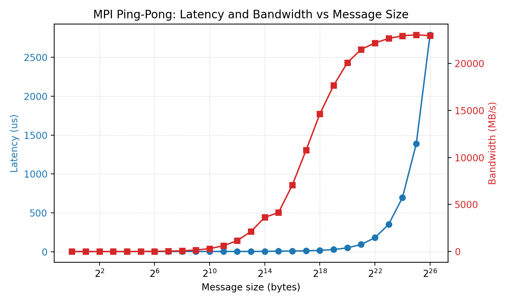

# MPI ping-pong

Two-rank latency/bandwidth test using blocking send/recv. Rank 0 sends a
message to rank 1 and receives it back; results are reported per message size.

## Example plot
The plot below shows one-way latency and effective bandwidth versus message
size from a sample run. Latency stays nearly flat for small messages and grows
with size, while bandwidth ramps up and approaches a plateau at large messages.



## Build
```bash
make
```

## Run (example)
```bash
mpirun -np 2 --ppn 1 ./pingpong --min 1 --max 8M --iters 1000 --warmup 100
```

## Options
- `--min SIZE` minimum message size (bytes or K/M/G suffix)
- `--max SIZE` maximum message size (bytes or K/M/G suffix)
- `--iters N` timed iterations (default 1000)
- `--warmup N` warmup iterations (default 100)
