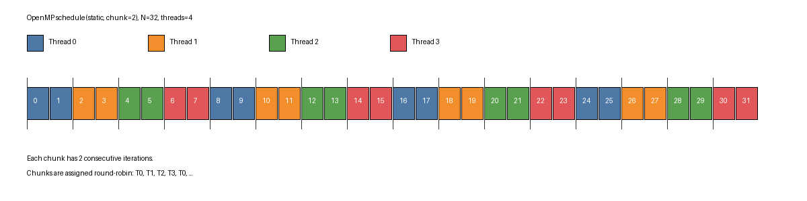

# OpenMP parallel for

Examples of the same array-addition loop:
- `parallel_for_serial` (serial)
- `parallel_for_omp` (OpenMP `parallel for` + timing)
- `parallel_for_dist` (prints which thread handles each index)
- `parallel_for_static_chunk` (OpenMP `for schedule(static, chunk)`)
- `parallel_for_schedule_bench` (benchmark with `schedule(runtime)`)

## Build
```bash
make
```

## Run
```bash
./parallel_for_serial
OMP_NUM_THREADS=4 ./parallel_for_omp
OMP_NUM_THREADS=4 ./parallel_for_dist
OMP_NUM_THREADS=4 ./parallel_for_static_chunk 2
OMP_NUM_THREADS=4 OMP_SCHEDULE="static,8" ./parallel_for_schedule_bench 100000000 5
OMP_NUM_THREADS=1 python3 numpy_dot_simple.py
OMP_NUM_THREADS=8 python3 numpy_dot_simple.py
```

## Static chunk schematic
Example for `N=32`, `threads=4`, `chunk=2`:



## What to notice
- The OpenMP version splits the loop across threads.
- Each iteration is independent, so it is safe to parallelize.
- `parallel_for_dist` shows how iterations are distributed.
- `parallel_for_static_chunk` shows fixed-size chunk distribution.

## Simple NumPy dot product
`numpy_dot_simple.py` is a minimal example that prints `OMP_NUM_THREADS`,
runs `np.dot(a, b)`, and reports elapsed time.

## Benchmark cases
Run each case for thread counts `1 2 4 6 8` and compare `avg_per_repeat_s`.

Case 1: `static` default
```bash
for t in 1 2 4 6 8; do OMP_NUM_THREADS=$t OMP_SCHEDULE="static" ./parallel_for_schedule_bench 100000000 5; done
```

Case 2: `static,1` (many tiny chunks)
```bash
for t in 1 2 4 6 8; do OMP_NUM_THREADS=$t OMP_SCHEDULE="static,1" ./parallel_for_schedule_bench 100000000 5; done
```

Case 3: `static,64` (larger chunks)
```bash
for t in 1 2 4 6 8; do OMP_NUM_THREADS=$t OMP_SCHEDULE="static,64" ./parallel_for_schedule_bench 100000000 5; done
```

Case 4: `dynamic,1` (highest scheduling overhead)
```bash
for t in 1 2 4 6 8; do OMP_NUM_THREADS=$t OMP_SCHEDULE="dynamic,1" ./parallel_for_schedule_bench 100000000 5; done
```

Case 5: `dynamic,64` (reduced dynamic overhead)
```bash
for t in 1 2 4 6 8; do OMP_NUM_THREADS=$t OMP_SCHEDULE="dynamic,64" ./parallel_for_schedule_bench 100000000 5; done
```
