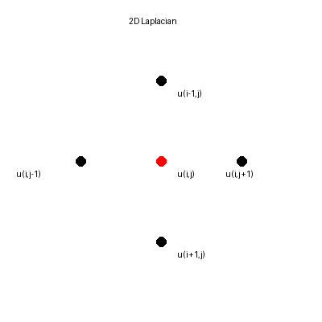

# Mechanics kernel: 2D Laplacian

Computes a 2D Laplacian stencil, a common kernel in mechanics PDE solvers.



Mathematical operator:
$$
\nabla^2 u = \frac{\partial^2 u}{\partial x^2} + \frac{\partial^2 u}{\partial y^2}
$$
Discrete 5-point stencil:
$$
\nabla^2 u_{i,j} \approx u_{i-1,j} + u_{i+1,j} + u_{i,j-1} + u_{i,j+1} - 4u_{i,j}
$$

Algorithm (what the code does):
- Initialize a 2D field `u`.
- For each interior grid point, compute the Laplacian with the 5-point stencil.
- Store the result in a separate array `lap`.

## Build
```bash
make
```

## Run
```bash
OMP_NUM_THREADS=4 ./laplacian2d
```
