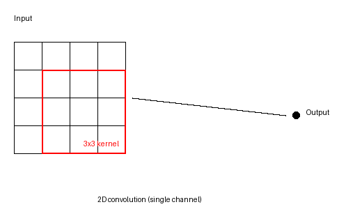

# AI kernel: 2D convolution

Implements a basic 2D convolution (NCHW layout) with a 3x3 kernel and padding.
This is a common kernel in CNNs and early stages of many vision models.



Mathematical form (single output channel):
$$
Y_{o,h,w} = \sum_{c=0}^{C_{in}-1} \sum_{i=0}^{K-1} \sum_{j=0}^{K-1} W_{o,c,i,j}\,X_{c,h+i-p, w+j-p}
$$

Algorithm (what the code does):
- Initialize input tensor `X` and weights `W`.
- For each output channel and spatial position, sum over input channels and kernel taps.
- Skip out-of-bounds indices to handle padding.

## Build
```bash
make
```

## Run
```bash
OMP_NUM_THREADS=4 ./conv2d
```
