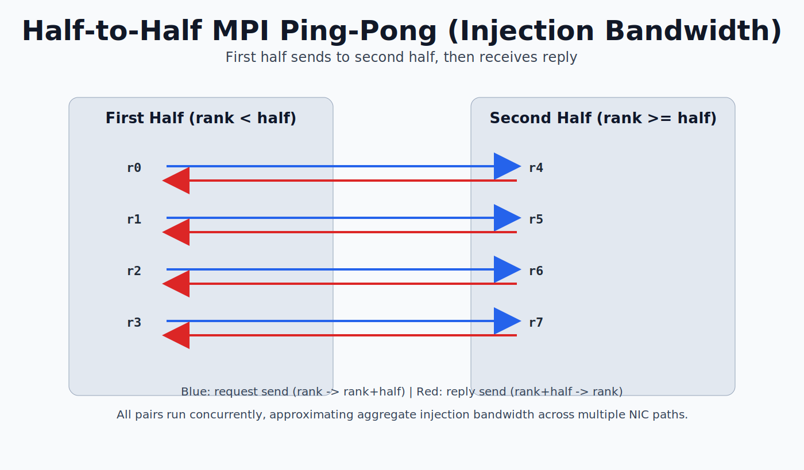

# 04 Ping-Pong

Simple MPI ping-pong benchmark to estimate NIC/link performance.

- rank 0 sends a message to rank 1, then receives it back
- repeated for many iterations
- reports average round-trip time and effective bandwidth

## Build
```bash
make
```

## Run
```bash
mpiexec -n 2 ./app

# custom: message_bytes iterations warmup
mpiexec -n 2 ./app 1048576 1000 100
```

Notes:
- Launch with at least 2 ranks; only ranks 0 and 1 participate in ping-pong.
- Use larger message sizes (for example 1 MiB to 64 MiB) to estimate bandwidth.

## In-Class Coding Exercise (20-25 min)

Goal: implement ping-pong timing and compute effective bandwidth.

1. Start from the starter file:
```bash
cp main_starter.c main.c
```
2. Implement TODOs in `main.c`:
- parse `message_bytes`, `iters`, `warmup` from argv
- allocate buffer
- warmup ping-pong between rank 0 and rank 1
- timed ping-pong with `MPI_Wtime`
- compute and print:
  - average round-trip time (microseconds)
  - effective bandwidth (GB/s)
3. Build and run:
```bash
make
mpiexec -n 2 ./app 1048576 1000 100
```

Expected output fields (rank 0):
- message size
- iterations
- average round-trip time
- effective bandwidth

Stretch goals:
- sweep message sizes from 1 KiB to 64 MiB
- plot bandwidth vs message size
- compare one-node vs two-node results

## Pairwise Multi-Lane Ping-Pong Schematic (Homework assignment)

For half-to-half pair testing (`main_pairs.c`), first-half ranks send to second-half counterparts and get replies back:
- sender-side partner rule: `partner = rank + half` for `rank < half`
- receiver-side partner rule: `partner = rank - half` for `rank >= half`

This creates concurrent lanes that can approximate aggregate injection bandwidth across multiple NIC paths.


