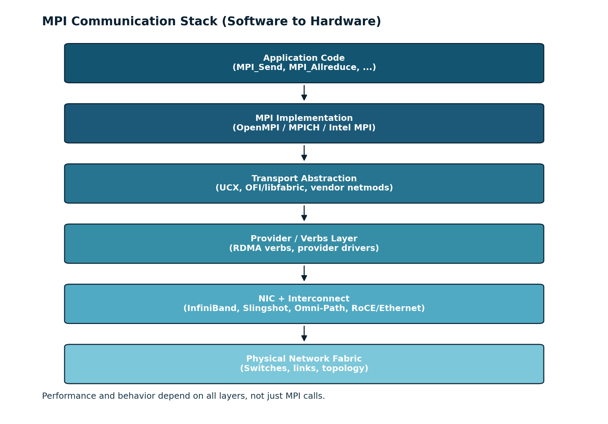
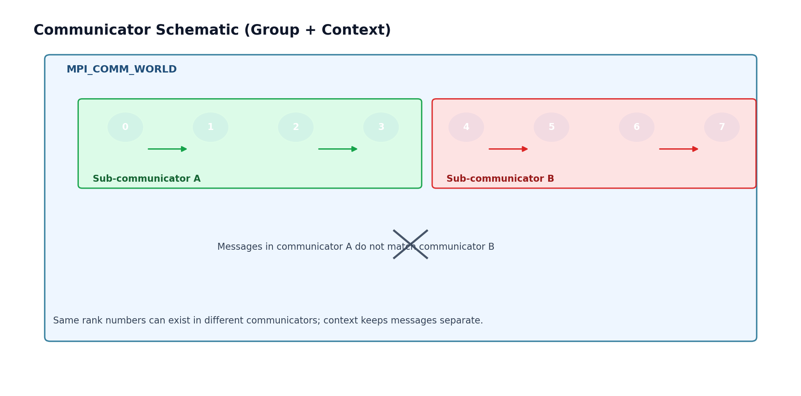
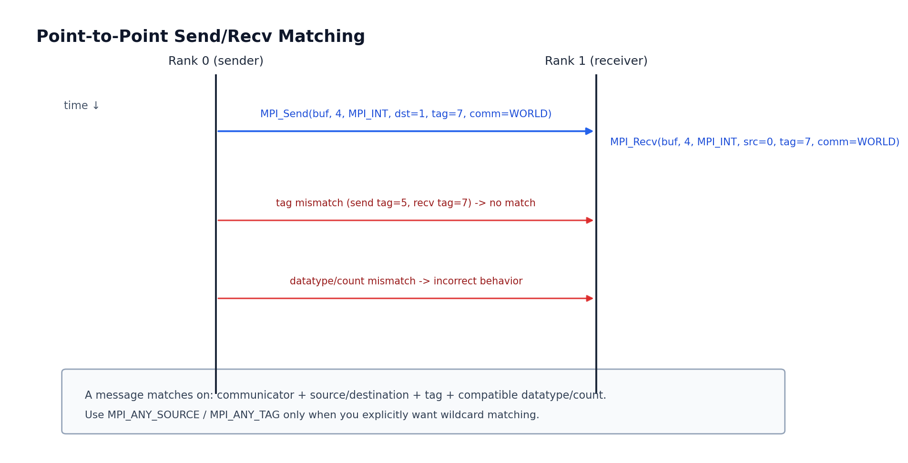
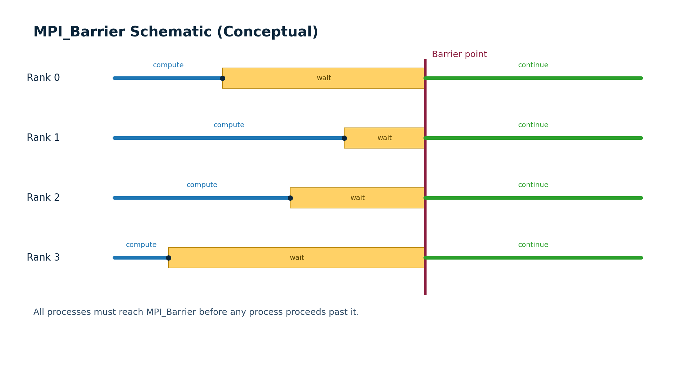
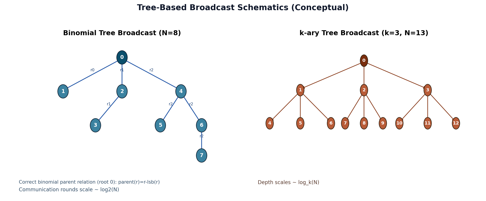
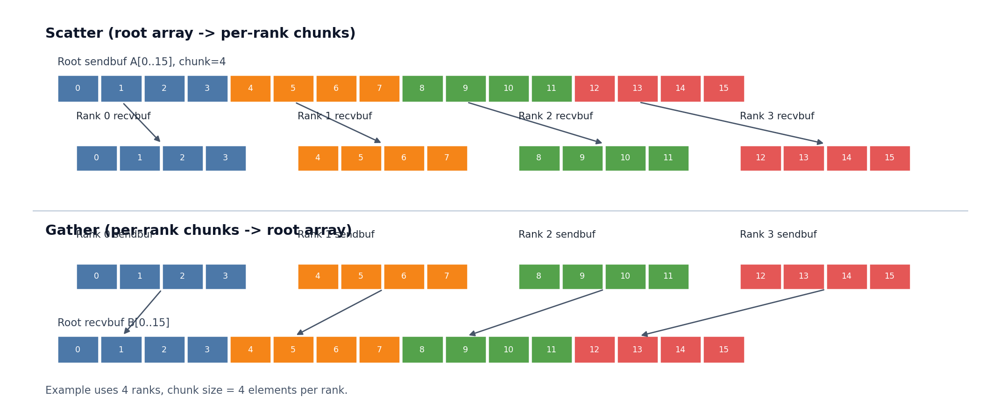

# Chapter 14: The Essential MPI

- Course: CSCI394 High Performance Computing
- Text: *High Performance Computing: Modern Systems and Practices* (2025), Chapter 14
- Focus: practical MPI programming for distributed-memory systems

---

# Learning Outcomes

By the end of this lecture, students can:

- explain why distributed memory requires message passing
- write a minimal MPI program (`MPI_Init`, `MPI_Finalize`)
- use communicator concepts (`MPI_COMM_WORLD`, rank, size)
- implement point-to-point transfer (`MPI_Send`, `MPI_Recv`)
- apply core collectives (`Bcast`, `Scatter`, `Gather`, `Reduce`, `Allreduce`)
- debug common MPI mistakes (mismatched send/recv, deadlock, wrong counts)

---

# Why MPI?

- Shared-memory scaling is limited by one node.
- Modern HPC systems scale via many nodes.
- Each node has private memory.
- MPI is the standard interface to coordinate work and move data.

Key idea: no direct remote memory load/store; data moves through messages.

---

# Distributed-Memory Mental Model

- Process = independent address space.
- Process identity is `(communicator, rank)`.
- Parallel program = SPMD style (same code, different rank behavior).
- Communication is explicit and must be correct.

Design rule: compute locally, communicate only what is necessary.

---

# MPI Program Skeleton

```c
#include <mpi.h>

int main(int argc, char **argv) {
    MPI_Init(&argc, &argv);

    // MPI work here

    MPI_Finalize();
    return 0;
}
```

Interpretation:

- `MPI_Init`: joins the MPI runtime, sets up process metadata/`MPI_COMM_WORLD`, and initializes transport paths (shared memory/network) so communication can begin.
- `MPI_Finalize`: completes outstanding MPI cleanup, tears down communication/runtime state, and exits MPI mode cleanly for all processes.

Practical rule: no MPI communication/query before `MPI_Init`, and no MPI calls after `MPI_Finalize`.

---

# Communication Software Stack (Top to Bottom)



Key idea: MPI is the API students program, while UCX/libfabric and lower layers determine much of the real communication behavior and performance.

---

# Build and Launch

Typical workflow on lab systems:

```bash
mpicc main.c -o app
mpiexec -n 4 ./app
```

Notes:

- `mpicc` is common for C builds with OpenMPI/MPICH.
- Some systems provide MPI-enabled wrappers as `cc` (C) and `CC` (C++).
- On Slurm systems, launcher is often `srun` (for example `srun -n 4 ./app`).
- On older Cray systems, launcher may be `aprun` (for example `aprun -n 4 ./app`).
- Exact compile/launch commands are site specific; always check cluster docs.

---

# Communicators, Size, Rank

From Chapter 14: MPI provides a communicator object to organize cooperating
processes and define a communication context. A communicator identifies which
processes can communicate in that scope and keeps messages in one context
separate from messages in another.

Key point: MPI communication operations only match among processes that are in
the same communicator.
MPI can also create sub-communicators (for example with `MPI_Comm_split`) so
different process groups can communicate independently for different purposes.

```c
int size, rank;
MPI_Comm_size(MPI_COMM_WORLD, &size);
MPI_Comm_rank(MPI_COMM_WORLD, &rank);
```

- `MPI_COMM_WORLD`: default communicator containing all processes.
- `size`: number of processes in the communicator.
- `rank`: unique process ID in `[0, size-1]`.

---

# Communicator Schematic



---

# Teaching Demo 1

Use local code:

- `csci394-spring26/06_mpi/01_hello`
- `csci394-spring26/06_mpi/02_rank_info`

Commands:

```bash
cd csci394-spring26/06_mpi/01_hello && make && mpiexec -n 4 ./app
cd ../02_rank_info && make && mpiexec -n 4 ./app
```

Prompt students: why output order is not deterministic?

---

# Point-to-Point Messaging

Core primitives:

- `MPI_Send(...)`
- `MPI_Recv(...)`

Message matching fields:

- communicator
- source/destination rank
- tag
- datatype + count

All must be compatible between sender and receiver.

---

# `MPI_Send` and `MPI_Recv`

```c
MPI_Send(buf, count, datatype, dst_rank, tag, comm);
MPI_Recv(buf, count, datatype, src_rank, tag, comm, &status);
```

Good practice:

- define symbolic tags (`#define TAG_TOKEN 100`)
- keep datatypes/counts symmetric
- check boundary ranks before sending

---

# Point-to-Point Matching Schematic



---

# MPI Datatypes (Common C Mappings)

Use an MPI datatype that matches the C buffer element type.

| C type | MPI datatype |
|---|---|
| `char` | `MPI_CHAR` |
| `int` | `MPI_INT` |
| `long` | `MPI_LONG` |
| `long long` | `MPI_LONG_LONG` |
| `unsigned int` | `MPI_UNSIGNED` |
| `float` | `MPI_FLOAT` |
| `double` | `MPI_DOUBLE` |
| `long double` | `MPI_LONG_DOUBLE` |
| `_Bool` | `MPI_C_BOOL` |
| byte buffer (`unsigned char*`) | `MPI_BYTE` |

Key rule: if C type, `count`, and MPI datatype do not agree between sender and
receiver, results are undefined or incorrect.

---

# Teaching Demo 2: First Send/Recv

Use local code:

- `csci394-spring26/06_mpi/03_send_recv`

Command:

```bash
cd csci394-spring26/06_mpi/03_send_recv && make && mpiexec -n 2 ./app
```

Discussion:

- what happens if launched with `-n 1`?
- what if receiver expects a different datatype?

---

# Ping-Pong Bandwidth Pattern

Two-rank microbenchmark for network/NIC measurement:

- rank 0 sends a message to rank 1
- rank 1 sends the same-size message back to rank 0
- repeat many iterations and time with `MPI_Wtime`

Estimate effective bandwidth:

- `BW ~= (2 * message_bytes * iters) / elapsed_time`

---

# Teaching Demo 3: Ping-Pong Bandwidth

Use local code:

- `csci394-spring26/06_mpi/04_ping_pong`

Command:

```bash
cd csci394-spring26/06_mpi/04_ping_pong && make && mpiexec -n 2 ./app 1048576 1000 100
```

Question: how does measured bandwidth change as message size increases?

---

# Collective Communication (General Idea)

MPI collectives are group operations executed by all processes in a communicator.

- every participating rank in that communicator must call the same collective
- the call order must be consistent across ranks to avoid hangs
- collectives encode common communication patterns (one-to-all, all-to-one, all-to-all)
- MPI implementations can optimize these patterns better than manual send/recv code

Think of collectives as coordinated communication contracts over a communicator.

---

# Synchronization Collective: Barrier

```c
MPI_Barrier(MPI_COMM_WORLD);
```

- blocks until all processes reach the barrier
- useful for phase boundaries and clean timing windows
- overuse can hurt performance

Rule: synchronize for correctness first, then optimize.



---

# Communication Collectives

One-to-many / many-to-one / all-to-all patterns:

- `MPI_Bcast`
- `MPI_Scatter`
- `MPI_Gather`
- `MPI_Allgather`
- `MPI_Alltoall`
- `MPI_Reduce`
- `MPI_Allreduce`

Collectives are usually faster and safer than manual point-to-point equivalents.

---

# Broadcast

```c
MPI_Bcast(data, n, MPI_DOUBLE, root, MPI_COMM_WORLD);
```

- root rank provides data
- all ranks receive identical copy
- common for parameters, model weights, lookup tables
- common implementation: tree-based broadcast (binomial/k-ary tree)
- communication steps can scale as `O(log N)` with process count (vs naive `O(N)`)

---

# Broadcast Tree Schematics



---

# Scatter and Gather

```c
MPI_Scatter(sendbuf, chunk, MPI_FLOAT,
            recvbuf, chunk, MPI_FLOAT,
            root, MPI_COMM_WORLD);

MPI_Gather(sendbuf, chunk, MPI_FLOAT,
           recvbuf, chunk, MPI_FLOAT,
           root, MPI_COMM_WORLD);
```

- scatter: partition root data to all ranks
- gather: collect rank-local pieces back to root

---

# Scatter/Gather Array Schematic



---

# Reduction and Allreduce

```c
MPI_Reduce(local, global, 1, MPI_DOUBLE, MPI_SUM, root, MPI_COMM_WORLD);
MPI_Allreduce(local, global, 1, MPI_DOUBLE, MPI_SUM, MPI_COMM_WORLD);
```

- reduction ops: `SUM`, `MAX`, `MIN`, `PROD`, ...
- `Reduce`: result only at root
- `Allreduce`: result on all ranks

---

# Teaching Demo 4: Collectives + Reduction

Use local code:

- `csci394-spring26/06_mpi/05_collectives`
- `csci394-spring26/06_mpi/06_pi_reduce`
- `csci394-spring26/06_mpi/08_allreduce`

Commands:

```bash
cd csci394-spring26/06_mpi/05_collectives && make
mpiexec -n 4 ./bcast
mpiexec -n 4 ./scatter
mpiexec -n 4 ./gather
mpiexec -n 4 ./reduce
cd ../06_pi_reduce && make && mpiexec -n 8 ./app 50000000
cd ../08_allreduce && make && mpiexec -n 4 ./app 200000
```

---

# Nonblocking Communication

Core calls:

- `MPI_Isend`
- `MPI_Irecv`
- completion with `MPI_Wait` / `MPI_Waitall`

Purpose:

- avoid unnecessary blocking
- overlap communication and computation

---

# Nonblocking Pattern Example

```c
MPI_Request reqs[2];
MPI_Irecv(recvbuf, n, MPI_DOUBLE, src, tag, comm, &reqs[0]);
MPI_Isend(sendbuf, n, MPI_DOUBLE, dst, tag, comm, &reqs[1]);

// local compute can happen here

MPI_Waitall(2, reqs, MPI_STATUSES_IGNORE);
```

Safety: do not reuse/overwrite send buffers before completion.

---

# Teaching Demo 5: Nonblocking Neighbor Exchange

Use local code:

- `csci394-spring26/06_mpi/07_nonblocking`

Command:

```bash
cd csci394-spring26/06_mpi/07_nonblocking && make && mpiexec -n 4 ./app
```

Prompt: where can computation be overlapped in this code?

---

# Common MPI Bugs (and fixes)

- deadlock from circular blocking sends
- tag mismatch between sender/receiver
- datatype/count mismatch
- rank out of range
- missing `MPI_Finalize`
- timing without synchronization

Debug strategy:

- test with `-n 2` first
- print rank-tag checkpoints
- scale process count gradually

---

# Performance Notes for Students

- Communication is expensive relative to floating-point math.
- Prefer fewer, larger messages over many tiny messages.
- Use collectives when possible.
- Minimize global synchronization.
- Balance work per rank; avoid idle ranks.

Rule of thumb: optimize communication pattern before micro-optimizing kernels.

---

# In-Class Exercise 1: Ping-Pong Coding (20-25 min)

Students implement the benchmark themselves.

Setup:

```bash
cd csci394-spring26/06_mpi/04_ping_pong
cp main_starter.c main.c
```

Tasks:

1. Parse `message_bytes`, `iters`, `warmup` from command line.
2. Implement warmup ping-pong between rank 0 and rank 1.
3. Add timed ping-pong with `MPI_Wtime`.
4. Compute:
   - average round-trip time (us)
   - effective bandwidth (GB/s)

Run target:

```bash
make
mpiexec -n 2 ./app 1048576 1000 100
```

Expected output fields (rank 0):

- message size
- iterations
- average round-trip time
- effective bandwidth

Deliverable before class ends:

- working `main.c` in `04_ping_pong`
- one short observation: how bandwidth changes with message size

Stretch: sweep message sizes and discuss where bandwidth saturates.

---

# In-Class Exercise 2: Collectives (15 min)

Task:

- start from `06_pi_reduce`
- compute both global sum and global max of local contributions
- print results at root

Stretch goals:

- add timing with `MPI_Wtime`
- compare `Reduce` vs `Allreduce`

---

# Homework Recommendation

1. Implement matrix-vector multiply with MPI domain decomposition.
2. Use `Scatter` for rows, `Bcast` for vector, `Gather` for result.
3. Measure strong scaling for `n = 1, 2, 4, 8` processes.
4. Plot runtime and parallel efficiency.

Deliverables: source, run script, timing table, scaling plot.

---

# Wrap-Up

Students should now be able to:

- reason about distributed-memory execution
- write correct MPI lifecycle and communicator code
- choose between point-to-point and collectives
- use reduction patterns for global quantities
- apply nonblocking calls for overlap and safer communication structure

Next: intermediate MPI topics (derived datatypes, advanced collectives, topologies).

---