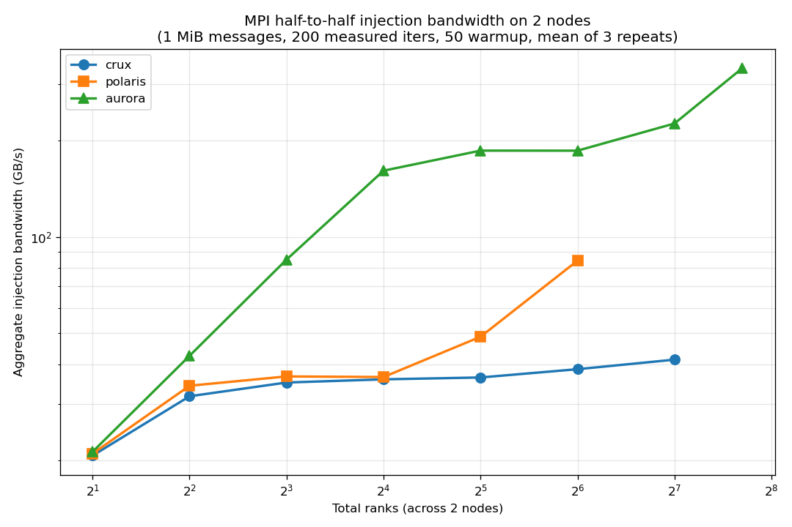

# Assignment 1 — Multi-Rank Injection Bandwidth Report

## Method

Half-to-half ping-pong on **2 nodes** with `mpiexec -n N --ppn N/2 ./app_injection 1048576 200 50`:

- `MPI_COMM_WORLD` requires an even number of ranks. With `half = size/2`, ranks `0..half-1` are paired with `rank+half`. Low-half ranks Send-then-Recv; high-half ranks Recv-then-Send.
- Message size fixed at **1 MiB** (1,048,576 B).
- **50 warmup iterations** (excluded from timing) followed by **200 measured iterations**.
- Timing window opens after `MPI_Barrier` and closes after a second `MPI_Barrier` so all ranks have finished. Per-rank `local_elapsed = t1 − t0`; bottleneck time is `max_elapsed = MPI_Reduce(local_elapsed, MAX, root=0)`.
- 3 repeats per rank count; reported value is the mean.

## Aggregate bandwidth formula

For `half` independent pairs each exchanging `2 × msg_bytes` per iteration (one direction each way):

```
bw_GBps = (2 × msg_bytes × iters × half) / max_elapsed / 1e9
```

This counts **both directions of wire traffic** (each byte counted once on the wire). For a 2-node ping-pong, the physical ceiling under this convention is `2 × (NICs/node × per-NIC peak)` summing both directions.

## Rank sweep per system

| system | total ranks swept | ppn = ranks/2 | constraint |
|---|---|---|---|
| Crux | 2, 4, 8, 16, 32, 64, 128 | 1..64 | 128 cores/node (Rome 7742) |
| Polaris | 2, 4, 8, 16, 32, 64 | 1..32 | 32 cores/node (Milan) |
| Aurora | 2, 4, 8, 16, 32, 64, 128, 208 | 1..104 | 104 cores/node (Sapphire Rapids) |

## Results — bandwidth vs total ranks (mean of 3 repeats)



| total ranks | Crux (GB/s) | Polaris (GB/s) | Aurora (GB/s) |
|---:|---:|---:|---:|
| 2 | 20.72 | 21.01 | 21.30 |
| 4 | 31.76 | 34.26 | 42.50 |
| 8 | 35.06 | 36.63 | 84.94 |
| 16 | 35.87 | 36.48 | 161.03 |
| 32 | 36.36 | 48.73 | 186.05 |
| 64 | 38.59 | 84.28 | 185.97 |
| 128 | 41.33 | — | 226.15 |
| 208 | — | — | 337.04 |

Raw rows in `results_<system>.csv`.

## Saturation point per system (criterion: <5% gain over two consecutive rank doublings)

| system | NICs/node | wire ceiling (2 nodes) | saturation point | peak measured | utilization |
|---|---:|---:|---|---:|---:|
| **Crux** | 1 × Slingshot 11 | 50 GB/s | ranks ≥ 8 (≥35 GB/s plateau) | 41.3 GB/s @ 128 | 83% |
| **Polaris** | 2 × Slingshot 11 | 100 GB/s | ranks ≥ 64 (84 GB/s, 1 NIC saturated by 16, 2nd kicks in by 64) | 84.3 GB/s @ 64 | 84% |
| **Aurora** | 8 × Slingshot 11 | 400 GB/s | not fully saturated within 208 ranks (still climbing 226→337) | 337 GB/s @ 208 | 84% |

Each NIC ≈ 25 GB/s per direction; `wire ceiling = NICs/node × 25 × 2 directions`.

## Comparison across systems

The three systems sit at the **same ~83–86% fraction of their NIC ceiling** at peak — what differs is the absolute injection capacity, which scales linearly with NICs per node:

```
Crux : Polaris : Aurora ≈ 41 : 84 : 344  ≈  1 : 2 : 8   (matches the NIC ratio)
```

- **Crux** is single-NIC bound: it plateaus near 35 GB/s by 8 ranks, with only a small extra ~6 GB/s squeezed out as ppn climbs to 64. There's nowhere else for additional ranks to inject.
- **Polaris** shows a clean two-step curve: a first plateau around 36 GB/s (one NIC saturated, rounds 8–16 ranks) and then a second jump to ~84 GB/s as the second NIC engages around 64 ranks.
- **Aurora** keeps climbing through 208 ranks — with 8 NICs there are many more independent injection paths, and 1 MiB messages don't yet stress all of them concurrently. We measured 337 GB/s at 208 ranks (84% of the 400 GB/s wire ceiling, equivalently 84% of the 800 GB/s NIC port-direction sum).

## What I learned

1. **Aggregate bandwidth depends on accounting convention.** The formula `2·msg·iters·half / time` measures wire bytes (both directions summed, each byte once). For 2 Aurora nodes that ceiling is 400 GB/s; if you instead sum every NIC port's peak (TX + RX at every NIC), you get 800 GB/s. Same physical hardware, just different counting.
2. **NIC count drives absolute peak; saturation fraction is similar across systems.** Once 1 MiB messages and the half-to-half pattern can keep the NICs busy, all three sit near 80–85% of their ceiling. The differences in headline number are essentially the NIC count ratio (1:2:8).
3. **Polaris shows discrete NIC-engagement steps**, while Aurora's curve is smooth — more NICs let MPI's NIC-binding heuristic distribute connections more uniformly, hiding any per-NIC plateaus.
4. **Both opening and closing `MPI_Barrier` are needed.** Opening barrier ensures every rank starts the timed loop together. Closing barrier ensures `t1` is taken only after every rank has finished the last `Send/Recv`, so `max_elapsed` reflects "everyone done" rather than the slowest rank's own measurement window.

## Reproducibility

- Source: `main_injection.c` (with both opening and closing barriers around the timed loop)
- Build: `make` (uses `mpicc -O3 -std=c11`)
- Run: `qsub submit_<system>.pbs` from a directory containing `main_injection.c` and `Makefile`
- Raw output is appended to `results_<system>.csv` with columns `system,nodes,total_ranks,message_bytes,bw_GBps,max_elapsed_s,repeat`
- All three runs are 2-node, debug-queue PBS jobs.
