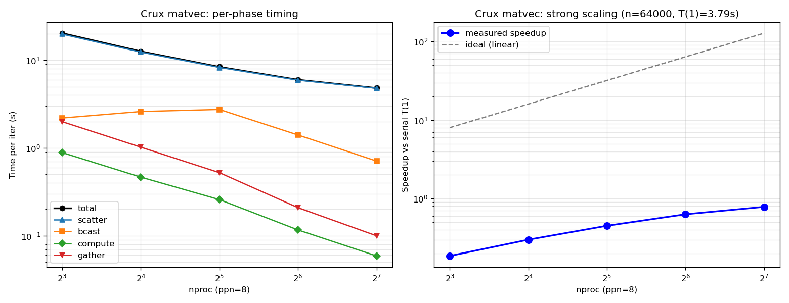

# Assignment 2 — Matrix-Vector Strong Scaling Report (Crux)

## Method

Dense matvec `y = A·x` with row decomposition on **Crux** (`workq-route`, ppn = 8):

1. Root rank 0 owns the full `A (n × n)` and `x (n)`; all ranks allocate local `A_local[rows_local × n]` and `y_local[rows_local]` where `rows_local = n / nproc`.
2. **`MPI_Scatter`** distributes equal row blocks of `A`.
3. **`MPI_Bcast`** sends `x` to every rank.
4. Local compute: `y_local[i] = Σ_j A_local[i, j] · x[j]`.
5. **`MPI_Gather`** collects `y_local` chunks back to root.

Each phase is timed with `MPI_Wtime`, then `MPI_Reduce(..., MAX)` is taken across ranks. **1 warmup iteration is excluded** from measured statistics; the next **5 iterations** are averaged. Run parameters: `n = 64000`, `iters = 5`, `warmup = 1`.

## Timing table (per-iteration, average over 5 measured iterations)

| phase \ nodes | 1 (8 ranks) | 2 (16 ranks) | 4 (32 ranks) | 8 (64 ranks) | 16 (128 ranks) |
|---|---:|---:|---:|---:|---:|
| scatter | 19.87 | 12.38 | 8.27 | 5.93 | **4.79** |
| broadcast | 2.19 | 2.60 | 2.75 | 1.41 | 0.71 |
| matvec_local | 0.89 | 0.47 | 0.26 | 0.12 | 0.06 |
| gather | 2.00 | 1.02 | 0.52 | 0.21 | 0.10 |
| **total** | **20.35** | **12.62** | **8.40** | **5.99** | **4.82** |

Serial baseline (`main_series.x`, no MPI): `T(1) = 3.785 s/iter`.

| nodes | nproc | total (s) | speedup S(p) = T(1)/T(p) | efficiency S(p)/p |
|---:|---:|---:|---:|---:|
| serial | 1 | 3.785 | 1.000 | 100.0% |
| 1 | 8 | 20.35 | 0.186 | 2.3% |
| 2 | 16 | 12.62 | 0.300 | 1.9% |
| 4 | 32 | 8.40 | 0.451 | 1.4% |
| 8 | 64 | 5.99 | 0.632 | 1.0% |
| 16 | 128 | 4.82 | 0.786 | 0.6% |

Raw rows in `timing.csv`.

## Scaling plot



- **Left panel**: per-phase wallclock per iteration on log-log axes. `compute` (green) decreases nearly perfectly — drops from 0.89 s at 8 ranks to 0.06 s at 128 ranks, a 14.8× reduction across a 16× rank increase. `scatter` (blue), `bcast` (orange), and `gather` (red) dominate the total.
- **Right panel**: measured speedup vs serial T(1), with the ideal-linear reference. Speedup reaches only 0.79× on 16 nodes / 128 ranks — the MPI version is **slower than serial** for every p tested.

## Where the scaling bottleneck comes from

**The matvec is scatter-bound, not compute-bound.** Three observations make this clear:

1. **Compute scales as expected.** `compute_s` shrinks from 0.89 → 0.06 s (≈15× over a 16× rank increase) — that's textbook good strong scaling for the local-row matvec. The arithmetic work per rank is `(n/p)·n` flops, exactly what we see.
2. **`MPI_Scatter` of A dominates and amortizes poorly.** The root sends `(n/p)·n·sizeof(double)` bytes to each of `p−1` workers. Total scatter volume is `(p−1)/p · n²·sizeof(double) ≈ 32 GB` for n=64000, and that volume **does not shrink with `p`** — each additional rank adds another receiver to the scatter tree but each rank still receives `n²/p` bytes from the root. At p=128, scatter still costs 4.79 s vs 0.06 s of compute — about **99% of total time is in collectives**.
3. **MPI is slower than serial.** The serial program never pays the scatter cost; it allocates `A` once in place and reuses it across all 5 iterations. The MPI program rebuilds the per-rank view of `A` on every iteration via `MPI_Scatter`, which is fundamentally expensive at this matrix size.

The algorithmic root cause is the **communication-to-compute ratio**. Per iteration:

```text
compute work / rank  = O(n² / p) flops
scatter volume / rank = O(n² / p) bytes (received from root)
ratio (flops / byte) = O(1)
```

A dense matvec has only ~1 flop per byte of A, so any algorithm that ships A around at every iteration is bandwidth-bound. To get useful strong scaling, A would need to be **either generated locally on each rank** (no scatter at all) or **partitioned once and reused** across many iterations.

## What I learned

1. **Phase-resolved timing is essential.** A single "total time" number would have made this look like a poorly-scaling MPI app. Splitting `MPI_Scatter` / `MPI_Bcast` / compute / `MPI_Gather` immediately points to the scatter as the offender, and shows that the local compute kernel is actually scaling fine.
2. **Compute-to-communication ratio bounds the achievable speedup.** Strong scaling requires `T_compute(p)` to dominate or at least track `T_comm(p)`; here `T_compute(p)` shrinks linearly while `T_comm(p)` shrinks much more slowly (the per-rank scatter receive shrinks with `p`, but the root's serialized fan-out doesn't), so the curves cross and the total flat-lines.
3. **Always include a serial baseline.** The MPI program's "speedup" relative to its own 8-rank run looks healthy (20.35 → 4.82, a 4.2× drop), but vs the true serial T(1) of 3.785 s, **even 16 nodes is slower than 1 core**. The lesson: never report MPI speedup against the smallest MPI configuration; use the genuine serial baseline.
4. **Cray PE GCC needed `-D_POSIX_C_SOURCE=199309L`** for `clock_gettime` / `CLOCK_MONOTONIC` to be declared from `<time.h>`. The default `-std=c11` doesn't expose POSIX symbols.

## Reproducibility

- Source: `main_mpi.c` (MPI version), `main_series.c` (serial baseline)
- Build: `make` (uses `mpicc -O3 -std=c11 -D_POSIX_C_SOURCE=199309L`)
- Run: `qsub submit_crux.pbs` from a directory containing the sources and Makefile
- Output appended to `timing.csv` with columns `system,nodes,nproc,n,iters,warmup,scatter_s,bcast_s,compute_s,gather_s,total_s`
- Submitted to Crux `workq-route` with `select=16` (16 nodes, ppn=8 → up to 128 ranks).
