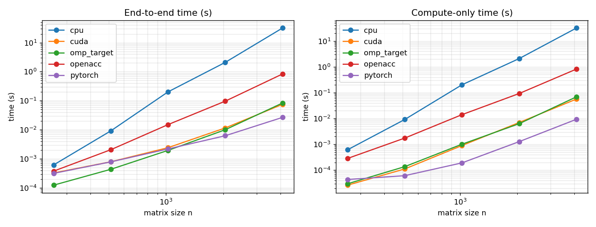

# Project 01 - GPU Offload Comparison

This project compares five implementations of dense FP32 matrix multiplication,
`C = A * B`, on one Polaris A100 GPU node:

1. OpenMP CPU baseline
2. OpenACC offload
3. OpenMP target offload
4. CUDA
5. PyTorch on CUDA

The sweep uses `n = 256, 512, 1024, 2048, 4096`. Each GPU version uses one
warmup iteration and five measured iterations. The CPU baseline uses the same
plan except at `n = 4096`, where it uses two measured iterations to fit inside
the debug allocation.

## System and Build

- System: ALCF Polaris, one compute node from the `debug` queue
- GPU: 1 NVIDIA A100-SXM4-40GB
- CPU baseline: OpenMP over the outer loops
- Compilers: NVHPC `cc`/`nvc` and CUDA `nvcc`
- CUDA target: `sm_80`
- PyTorch: ALCF conda PyTorch on CUDA

Compiler flags came from the included `Makefile`:

- CPU: `-O2 -mp -fast`
- OpenACC: `-O2 -acc -gpu=cc80 -Minfo=accel`
- OpenMP target: `-O2 -mp=gpu -gpu=cc80 -Minfo=mp`
- CUDA: `-O2 -arch=sm_80 -std=c++14`

## Timing Method

Each implementation reports:

- `end_to_end_s`: host-visible time including setup, host-device copies, and compute
- `compute_s`: timed compute region only
- `max_abs_err`: maximum absolute error on the checked output subset

CUDA compute time uses CUDA events. PyTorch compute time uses
`torch.cuda.Event`. The CPU reference check is sampled on a 64 x 64 sub-block so
that correctness checking does not dominate the benchmark at large matrix sizes.

The full data are in [`results/results.csv`](results/results.csv).

## Result Plot



## Selected Results

Compute throughput is calculated as `2*n^3 / compute_s`.

| n | Version | End-to-end (s) | Compute (s) | Compute GFLOP/s | Max abs err |
|---:|---|---:|---:|---:|---:|
| 256 | CPU | 6.14e-04 | 6.14e-04 | 54.7 | 0.0 |
| 256 | OpenACC | 3.76e-04 | 2.84e-04 | 118 | 7.6e-06 |
| 256 | OpenMP target | 1.24e-04 | 2.97e-05 | 1131 | 2.3e-05 |
| 256 | CUDA | 3.26e-04 | 2.62e-05 | 1280 | 3.8e-06 |
| 256 | PyTorch | 3.15e-04 | 4.33e-05 | 775 | 7.6e-06 |
| 1024 | CPU | 2.02e-01 | 2.02e-01 | 10.6 | 0.0 |
| 1024 | OpenACC | 1.51e-02 | 1.41e-02 | 152 | 3.1e-05 |
| 1024 | OpenMP target | 1.95e-03 | 1.01e-03 | 2125 | 2.4e-04 |
| 1024 | CUDA | 2.42e-03 | 8.98e-04 | 2391 | 1.5e-05 |
| 1024 | PyTorch | 2.19e-03 | 1.91e-04 | 11226 | 6.1e-05 |
| 4096 | CPU | 3.18e+01 | 3.18e+01 | 4.3 | 0.0 |
| 4096 | OpenACC | 8.33e-01 | 8.19e-01 | 168 | 1.2e-04 |
| 4096 | OpenMP target | 8.33e-02 | 6.89e-02 | 1996 | 4.9e-04 |
| 4096 | CUDA | 7.50e-02 | 5.65e-02 | 2434 | 6.1e-05 |
| 4096 | PyTorch | 2.67e-02 | 9.32e-03 | 14755 | 7.3e-04 |

## Discussion

For the smallest problem, `n = 256`, OpenMP target has the best end-to-end time
at about 0.12 ms. CUDA has the fastest kernel-only time, but the total runtime
includes launch and transfer overhead. The CPU baseline is already slower than
the GPU paths because the naive triple loop has poor cache locality and does
not use a tuned BLAS implementation.

For large matrices, PyTorch is the clear winner. At `n = 4096`, PyTorch reaches
about 14.8 TFLOP/s compute throughput and finishes end-to-end in about 27 ms.
This is much faster than the hand-written CUDA kernel because PyTorch dispatches
to an optimized GEMM library path, using tiled kernels and hardware features
that the naive CUDA code does not implement.

End-to-end time matters most for small matrices. At `n = 256` and `n = 512`,
copy and launch overhead are a large fraction of the total time. By `n = 1024`,
compute begins to dominate because matrix multiplication grows as `O(n^3)` while
host-device data movement grows as `O(n^2)`. This is the point where GPU offload
becomes increasingly favorable even for naive kernels.

OpenMP target and naive CUDA are in the same performance range for large
matrices. OpenACC is much slower with the original `collapse(2)` pragma, but the
follow-up test below shows that this is a scheduling issue rather than a
fundamental OpenACC limitation.

## OpenACC Scheduling Follow-up

The original OpenACC implementation used:

```c
#pragma acc parallel loop collapse(2)
```

On an A100 system with the same GPU architecture and NVHPC compiler family, four
OpenACC variants were compared:

| Variant | Pragma | n=1024 GFLOP/s | n=2048 GFLOP/s | n=4096 GFLOP/s |
|---|---|---:|---:|---:|
| v0 | `parallel loop collapse(2)` | 152 | 194 | 168 |
| v1 | `parallel loop collapse(2) gang vector(128)` | build error | build error | build error |
| v2 | `parallel loop tile(16,16)` | 2873 | 3111 | 2716 |
| v3 | `parallel loop tile(32,32)` | 2537 | 2720 | 3196 |

The `-Minfo=accel` output explains the gap. With `collapse(2)`, NVHPC mapped the
collapsed `(i,j)` loops to gangs and mapped the inner `k` loop to a
`vector(128)` reduction. That creates many tiny blocks and performs an
inter-thread reduction for each output element.

The tiled variants map a 2D tile of output elements across gangs and vectors,
while leaving the inner `k` loop sequential inside each thread. This is the
expected naive GEMM mapping: one thread owns one output element, no
cross-thread reduction is needed, and the kernel is about 16x faster.

The practical OpenACC fix is:

```c
#pragma acc parallel loop tile(16,16)
```

at both the warmup and measured kernel pragmas. The follow-up data are in
[`results/openacc_scheduling_sirius.csv`](results/openacc_scheduling_sirius.csv).

## Files

- Source: [`src/`](src)
- Build: [`Makefile`](Makefile)
- Raw results: [`results/results.csv`](results/results.csv)
- Runtime plot: [`results/runtime_vs_size.png`](results/runtime_vs_size.png)
- Raw logs: [`results/raw.log`](results/raw.log), [`results/pbs.out`](results/pbs.out)
- AI usage statement: [`AI_USAGE.md`](AI_USAGE.md)
