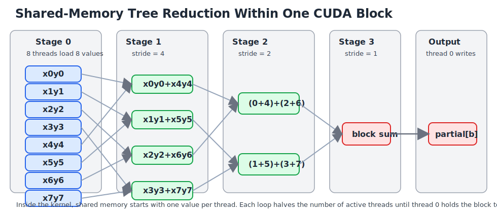

# CUDA reduction

This example introduces a core GPU pattern: reduce many values in parallel into
one scalar sum. To stay consistent with the earlier examples, this version
computes an inner product.

Mathematical operation:

$$
\mathrm{dot} = \sum_{i=0}^{N-1} x_i y_i
$$

What this example does:

- initializes two input vectors on the host
- copies both vectors to the GPU
- launches one CUDA kernel that computes one block-level partial sum per block
- copies the partial sums back to the host
- completes the final short sum on the CPU
- checks the result against a CPU reference

Data flow:

```text
host_x[0:N], host_y[0:N]
    |
    v
device_x[0:N], device_y[0:N]
    |
    v
inner_product_reduce_kernel
    |
    v
device_partial[0:num_blocks]
    |
    v
host_partial[0:num_blocks]
    |
    v
final CPU sum
```

Concepts:

- block-level reduction in shared memory
- `extern __shared__`
- `__syncthreads()`
- power-of-two block sizes
- one partial result per thread block

Why this example matters:

- it is the next conceptual step after elementwise kernels
- it shows that GPU threads often cooperate within a block, not just work independently
- it prepares students for more advanced reductions used in later CUDA codes

Key reduction idea:

```c
for (int stride = blockDim.x / 2; stride > 0; stride /= 2) {
    if (threadIdx.x < stride) {
        shared[threadIdx.x] += shared[threadIdx.x + stride];
    }
    __syncthreads();
}
```

How to read it:

- each block first stores one value per thread in shared memory
- the active thread count is cut in half each step
- neighboring values are added together
- thread 0 ends with the block's total

Schematic plot:



The picture shows one block reducing eight values:

- stage 0: each thread loads one product value into shared memory
- stage 1: 8 values become 4 partial sums
- stage 2: 4 values become 2 partial sums
- stage 3: 2 values become 1 block sum
- thread 0 writes that block sum into `partial[blockIdx.x]`

How this maps to the code:

- `gid = blockIdx.x * blockDim.x + threadIdx.x` picks the global element
- `value = x[gid] * y[gid]` computes one inner-product term per thread
- `shared[threadIdx.x] = value` stages one product per thread in shared memory
- the `for (stride = blockDim.x / 2; stride > 0; stride /= 2)` loop performs
  the tree reduction inside the block
- `if (threadIdx.x == 0)` writes the block result to global memory

Launch configuration:

- `threads_per_block` is both the CUDA block size and the shared-memory array
  length used by the reduction
- `num_blocks = ceil(N / threads_per_block)` so each block produces one partial
  sum
- dynamic shared memory size is
  `threads_per_block * sizeof(double)`
- the current reduction logic assumes `threads_per_block` is a power of two

Edge handling:

- if `gid >= n`, that thread contributes `0.0`
- this lets the last partially filled block still participate in the same
  reduction logic

Teaching note:

- this example keeps the final accumulation on the CPU so students can focus on
  one block-level reduction kernel first
- the next step would be a full multi-stage GPU reduction, similar to the later
  `08_cuda_pi` example

Build:

```bash
make
```

If your driver is older than the CUDA toolkit, build for the exact GPU target:

```bash
make CUDA_ARCH=sm_80
```

Run:

```bash
./app
./app 1000000 256
```

Arguments:

- first argument: `N`
- second argument: `threads_per_block`
- `threads_per_block` should be a power of two

Example:

```bash
./app 1048576 256
```

Typical output:

```text
CUDA reduction example
N=1048576 threads_per_block=256 num_blocks=4096
gpu_dot=2095576.499584000092 cpu_dot=2095576.499584000092 abs_err=0.000e+00 rel_err=0.000e+00
gpu_h2d=... ms gpu_kernel=... ms gpu_d2h=... ms gpu_total=... ms
```

Performance interpretation:

- `gpu_kernel` measures just the reduction kernel
- `gpu_total` includes host-to-device copy, kernel time, and device-to-host copy
- because this version still finishes the last accumulation on the CPU, it is
  a teaching example rather than a fully optimized production reduction

What students should learn:

- reductions require communication among threads in a block
- shared memory is useful for fast intra-block cooperation
- not every GPU algorithm is just one thread writing one output element
- a GPU reduction is often built in stages: block-local reduction first, then a
  smaller final reduction
- a dot product can be organized as "compute one product per thread, then reduce
  those products within each block"
