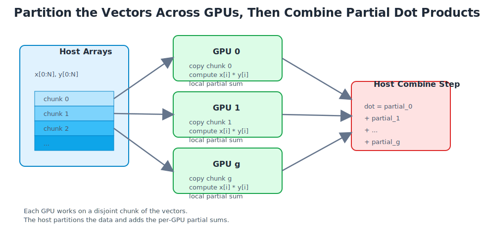

# CUDA multi-GPU inner product

This example extends the earlier single-GPU inner-product example to multiple
GPUs. Instead of sending the whole vector to one device, the program partitions
the input arrays into contiguous chunks, assigns one chunk to each GPU, computes
a local dot-product contribution on each device, and then adds the per-GPU
results on the host.

Mathematical operation:

$$
\mathrm{dot} = \sum_{i=0}^{N-1} x_i y_i
$$

Multi-GPU idea:

$$
\mathrm{dot} =
\sum_{g=0}^{G-1}
\left(
\sum_{i \in \mathrm{chunk}(g)} x_i y_i
\right)
$$

where `G` is the number of GPUs being used.

What this example does:

1. Initializes `x` and `y` on the host.
2. Computes a CPU reference dot product.
3. Queries how many CUDA devices are visible.
4. Splits the global index range `[0, N)` into one chunk per GPU.
5. For each GPU:
   copies that chunk to the device,
   launches a simple pointwise-product kernel,
   copies the temporary product array back,
   sums that chunk on the CPU.
6. Adds the per-GPU chunk sums into one final answer.

Data flow:

```text
host x[0:N], y[0:N]
        |
        +--> GPU 0 gets chunk 0 --> local products --> host partial 0
        |
        +--> GPU 1 gets chunk 1 --> local products --> host partial 1
        |
        +--> GPU 2 gets chunk 2 --> local products --> host partial 2
        |
        `--> ...

host final sum = partial_0 + partial_1 + partial_2 + ...
```

Schematic plot:



Concepts:

- `cudaGetDeviceCount`
- `cudaSetDevice`
- data partitioning across devices
- embarrassingly parallel decomposition
- one host thread controlling multiple GPUs sequentially
- final accumulation of per-GPU partial results on the CPU

Why this example is structured this way:

- each GPU has its own memory space, so each device only receives its own chunk
- the GPUs do not directly share the temporary product arrays in this example
- the host acts as the coordinator that launches work on each device and
  combines the partial sums
- this keeps the first multi-GPU lesson focused on decomposition, not advanced
  synchronization or peer-to-peer transfers

Why the reduction is still finished on the CPU:

- the goal here is to introduce multi-GPU workload partitioning first
- the kernel remains the same simple pointwise-product kernel from the earlier
  example
- each GPU computes "its part" of the dot product, and the host combines the
  resulting partial sums

Chunk partitioning:

- GPU `g` owns the index range
  `[ floor(gN/G), floor((g+1)N/G) )`
- this keeps the chunks contiguous and balanced
- if `N` is not divisible by `G`, the last chunk sizes differ by at most one

Build:

```bash
make
```

If your driver is older than the CUDA toolkit, build for the exact GPU target:

```bash
make CUDA_ARCH=sm_80
```

Run:

```bash
./app
./app 1000000
./app 1000000 2
```

Arguments:

- first argument: `N`
- second argument: maximum number of GPUs to use
- if the second argument is omitted or `0`, the program uses all visible GPUs

Typical output:

```text
CUDA multi-GPU inner product example
N=1000000 requested_gpus=2 visible_gpus=4 using_gpus=2
gpu_0 name=NVIDIA A100-SXM4-40GB range=[0,500000) chunk_n=500000 num_blocks=1954 partial=998332.500000000000
gpu_1 name=NVIDIA A100-SXM4-40GB range=[500000,1000000) chunk_n=500000 num_blocks=1954 partial=998332.500000000000
multi_gpu_dot=1996665.000000000000 cpu_dot=1996665.000000000000 abs_err=0.000e+00
```

What students should learn:

- multi-GPU programming usually starts with splitting the global problem into
  independent subproblems
- each GPU is often responsible for a separate chunk of the data
- the host must explicitly select devices and move each chunk to the right GPU
- a correct multi-GPU program often has a simple "local work + final combine"
  structure

Possible next steps:

- move the per-GPU summation from the CPU to a reduction kernel on each device
- overlap transfers and kernel launches with streams
- use one host thread per GPU for more concurrency
- compare single-GPU and multi-GPU runtime scaling
