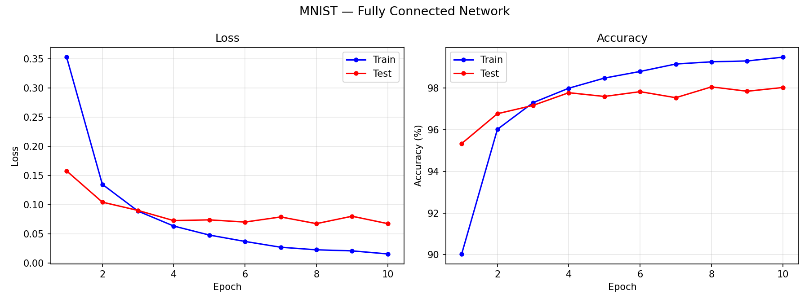
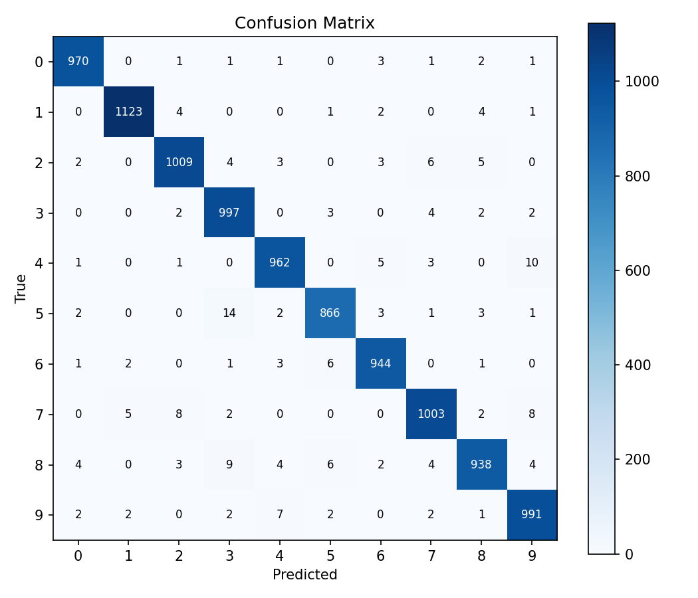
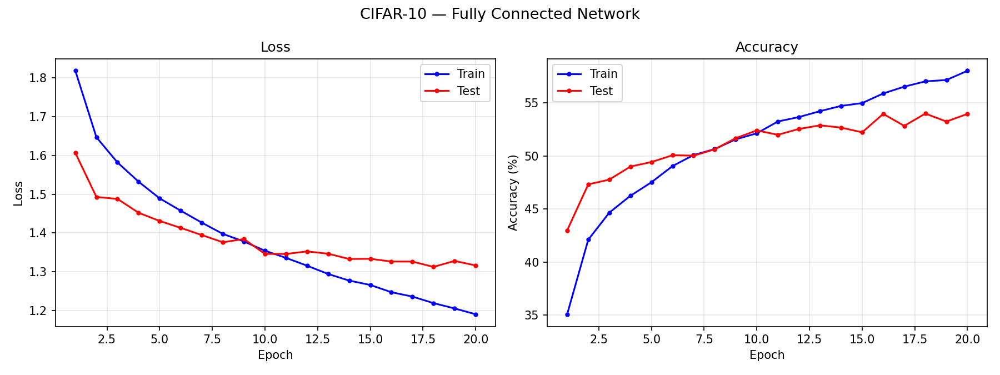
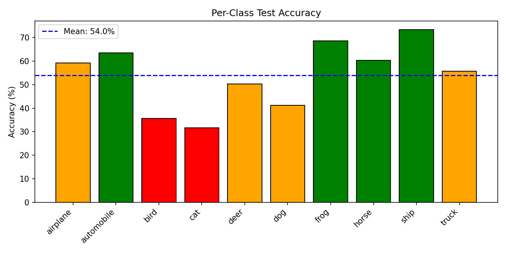
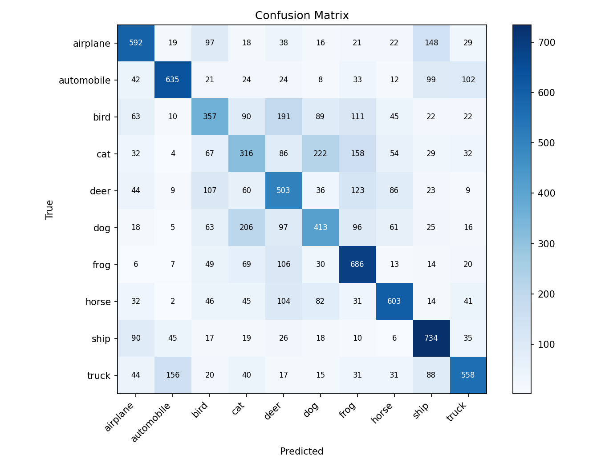
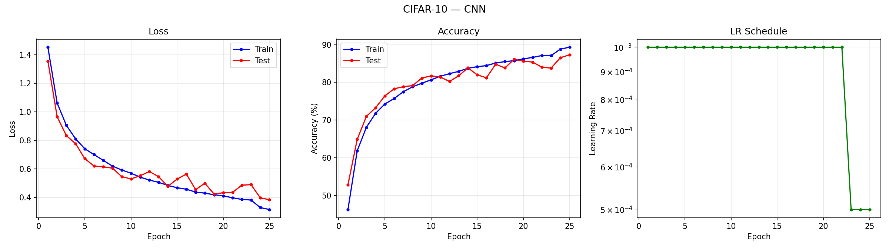
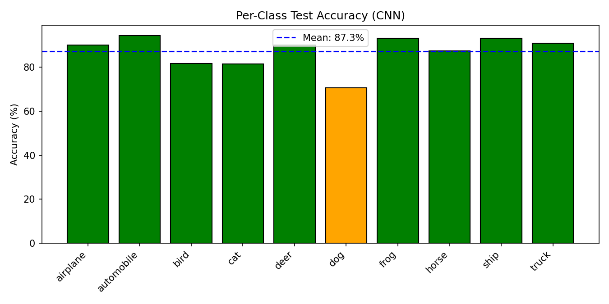
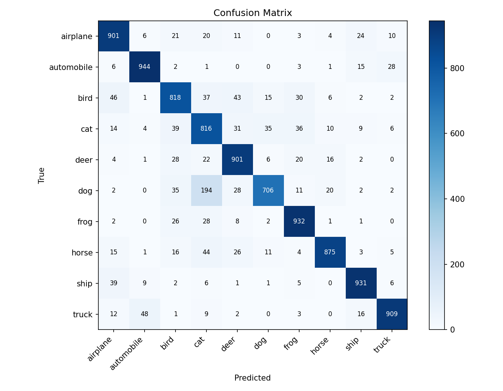
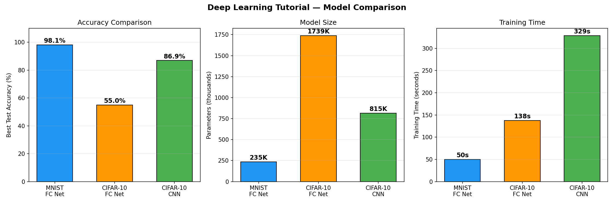
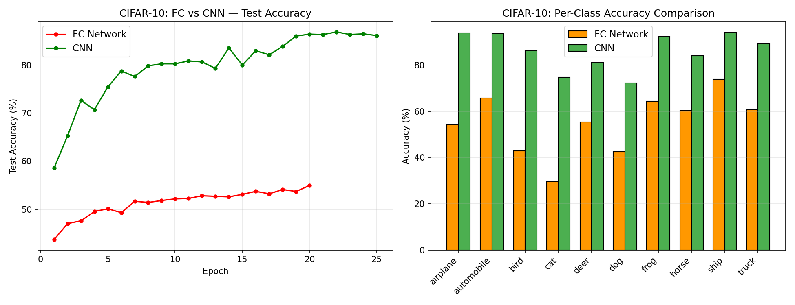

# Deep Learning Tutorial — Training Report

**CSCI 394 — Spring 2026**
**Device:** Apple MPS (Metal Performance Shaders)
**PyTorch version:** see individual runs

---

## Experiment Summary

| Metric | MNIST FC | CIFAR-10 FC | CIFAR-10 CNN |
|--------|----------|-------------|--------------|
| **Model** | FC(784→256→128→10) | FC(3072→512→256→128→10) + Dropout | 3×[Conv-BN-ReLU-Conv-BN-ReLU-MaxPool] + FC |
| **Parameters** | 235,146 | 1,738,890 | 815,018 |
| **Epochs** | 10 | 20 | 25 |
| **Data Augmentation** | No | No | Yes (RandomCrop, HFlip) |
| **LR Scheduling** | No | No | ReduceLROnPlateau |
| **Best Test Accuracy** | **98.13%** | **54.96%** | **86.93%** |
| **Final Test Accuracy** | 98.01% | 54.96% | 86.17% |
| **Final Train Accuracy** | 99.50% | 57.85% | 89.16% |
| **Final Test Loss** | 0.0714 | 1.3073 | 0.4294 |
| **Training Time** | 49.9s | 137.5s | 328.7s |

---

## 1. MNIST — Fully Connected Network

A simple 3-layer fully connected network achieves **98.13%** test accuracy on MNIST
in just 10 epochs (50s). MNIST is a relatively easy benchmark:
handwritten digits are centered, grayscale, and low-resolution.

**Per-digit accuracy:**

| Digit | 0 | 1 | 2 | 3 | 4 | 5 | 6 | 7 | 8 | 9 |
|-------|---|---|---|---|---|---|---|---|---|---|
| Accuracy | 99.2% | 98.5% | 97.8% | 98.5% | 98.1% | 97.4% | 98.6% | 96.7% | 97.2% | 98.0% |

---

## 2. CIFAR-10 — Fully Connected Network

The same FC approach struggles on CIFAR-10, achieving only **54.96%** test accuracy.
This is expected: flattening a 32×32×3 color image into a 3072-dimensional vector destroys all spatial
structure. The model has 1,738,890 parameters (7× more than MNIST) but still underperforms.

**Per-class accuracy:**

| Class | airplane | auto | bird | cat | deer | dog | frog | horse | ship | truck |
|-------|----------|------|------|-----|------|-----|------|-------|------|-------|
| Accuracy | 54.3% | 65.7% | 42.8% | 29.7% | 55.4% | 42.5% | 64.3% | 60.3% | 73.8% | 60.8% |

Key observations:
- **Cat** (29.7%) and **dog** (42.5%) are the hardest — they share similar shapes and textures
- **Ship** (73.8%) and **automobile** (65.7%) are easiest — distinct shapes and backgrounds

---

## 3. CIFAR-10 — Convolutional Neural Network

The CNN achieves **86.93%** test accuracy — a **32.0 percentage point improvement** over
the FC network — with **fewer parameters** (815,018 vs 1,738,890).

This demonstrates the power of convolutional architectures for image data:
- **Local feature detection** via convolution filters
- **Parameter sharing** across spatial locations
- **Hierarchical feature learning** (edges → textures → objects)
- **Translation invariance** via max pooling

**Per-class accuracy:**

| Class | airplane | auto | bird | cat | deer | dog | frog | horse | ship | truck |
|-------|----------|------|------|-----|------|-----|------|-------|------|-------|
| FC  | 54.3% | 65.7% | 42.8% | 29.7% | 55.4% | 42.5% | 64.3% | 60.3% | 73.8% | 60.8% |
| CNN | 93.8% | 93.7% | 86.4% | 74.7% | 81.0% | 72.3% | 92.3% | 84.1% | 94.1% | 89.3% |

The CNN improves **every single class**, with the largest gains on the hardest categories (cat: +45pp, dog: +30pp, bird: +44pp).

---

## Comparison

### Key Takeaways

1. **MNIST is easy for fully connected networks** — 98% accuracy is achievable with a simple 3-layer network and ~235K parameters.

2. **FC networks fail on natural images** — Despite having 7× more parameters, the CIFAR-10 FC model only reaches ~55%. Flattening images destroys spatial structure.

3. **CNNs are dramatically better for images** — With 2× fewer parameters, the CNN reaches ~87% on CIFAR-10. Convolutions preserve and exploit spatial locality.

4. **The accuracy gap tells the story**:
   - MNIST FC: 98.1% ✓ (FC is sufficient for simple, centered patterns)
   - CIFAR-10 FC: 55.0% ✗ (FC cannot handle complex, variable images)
   - CIFAR-10 CNN: 86.9% ✓ (CNNs capture the spatial features that matter)

5. **Supporting techniques matter**: Data augmentation, batch normalization, and LR scheduling all contribute to the CNN's superior performance.

---

## Training Time Summary

All experiments were run on Apple MPS (Metal Performance Shaders) GPU.

| Experiment | Epochs | Training Time |
| ---------- | ------ | ------------- |
| MNIST FC | 10 | 49.9s |
| CIFAR-10 FC | 20 | 137.5s |
| CIFAR-10 CNN | 25 | 328.7s |
| **Total** | **55** | **516.1s (~8.6 min)** |
