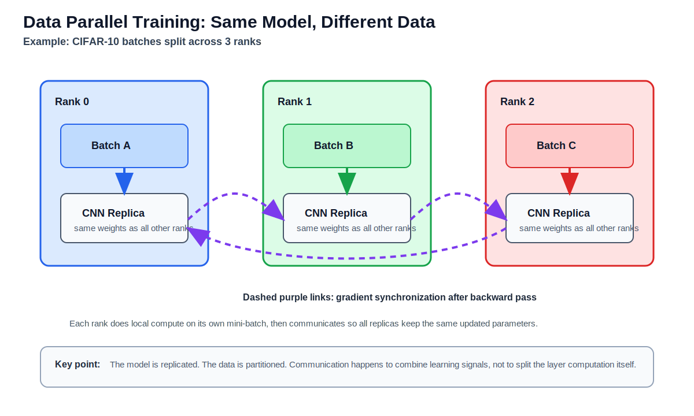
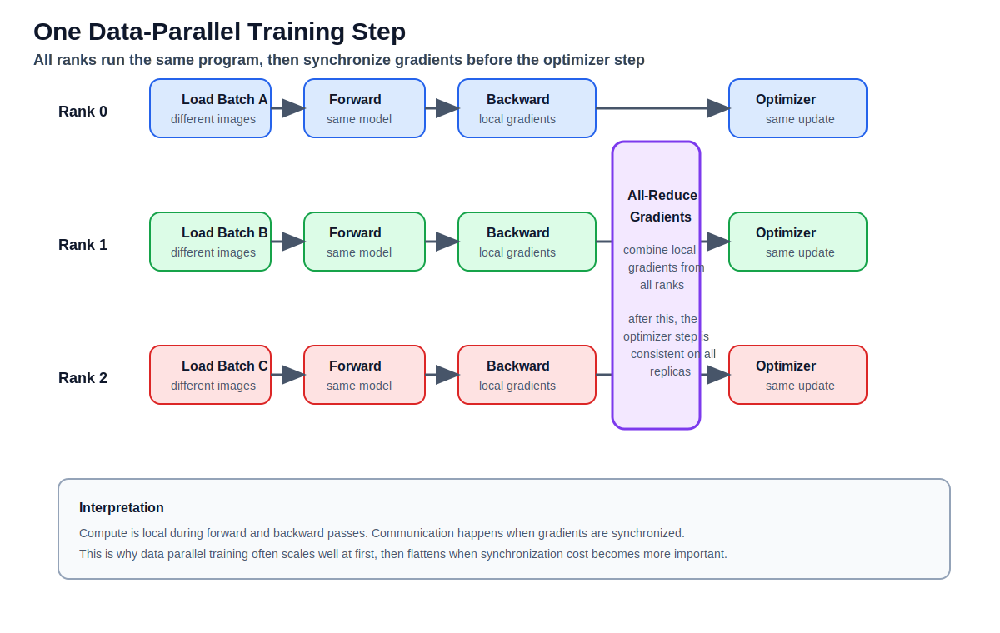

# Data Parallel Training

This note explains the core idea behind data parallel training using the
PyTorch Distributed Data Parallel (DDP) examples in this folder.

Relevant code examples:

- `main.py`
  Minimal synthetic DDP starter.
- `cifar10_example_python/main.py`
  CIFAR-10 CNN example with dataset sharding and global metric reduction.

## Big Idea

In data parallel training, every process keeps a full copy of the model, but
each process works on a different mini-batch.

Each training step has the same overall shape:

1. each rank reads a different batch
2. each rank runs the same forward pass
3. each rank computes local gradients
4. the ranks synchronize gradients
5. each rank applies the same optimizer update

After gradient synchronization, all model replicas stay numerically aligned, so
the next step starts from the same parameters on every rank.

## Schematic 1: Replicated Model, Sharded Data



What this picture is showing:

- rank 0, rank 1, and rank 2 all hold the same CNN architecture
- the training dataset is partitioned into different batches
- each rank processes a different batch at the same time
- communication is needed after backpropagation, not during the forward pass of
  this small model

This is why data parallelism fits the MPI/SPMD mindset well:

- same program on every rank
- same model structure on every rank
- different local data on each rank
- collective communication to keep the replicas consistent

## Schematic 2: One Training Step



The main workflow is:

1. **Load local batch**
   Each rank receives different images and labels.
2. **Forward pass**
   Every rank evaluates the same model on its local batch.
3. **Loss and backward pass**
   Every rank computes gradients from its own examples.
4. **All-reduce gradients**
   The processes exchange gradient values and form a global result.
5. **Optimizer step**
   Because the synchronized gradients match, each rank updates to the same new
   parameters.

In classroom language: the compute is local first, then the gradients are made
global.

## Connection to the CIFAR-10 Example

In `cifar10_example_python/main.py`, the important pieces are:

- `torchrun`
  Launches one process per device or worker.
- `DistributedSampler`
  Assigns different training samples to different ranks each epoch.
- `DDP(model, ...)`
  Wraps the model so gradient synchronization is handled automatically.
- `dist.all_reduce(...)`
  Combines per-rank metrics such as loss and accuracy for reporting.

The example also prints:

- `world_size`
  Number of participating processes.
- `batch_size_per_rank`
  Batch size seen by one process.
- `global_batch_size`
  `world_size * batch_size_per_rank`.

That global batch size matters when discussing scaling. If you double the
number of ranks and keep per-rank batch size fixed, the global batch size also
doubles.

## Why This Can Be Faster

If one GPU is too slow, then multiple GPUs can process more examples at the
same time:

- rank 0 computes on batch A
- rank 1 computes on batch B
- rank 2 computes on batch C

This can reduce wall-clock training time, especially when:

- each rank has enough computation to stay busy
- communication is relatively small compared to compute
- the input pipeline keeps up with the accelerators

## Why Scaling Eventually Flattens

Data parallel training is not free. Some costs do not disappear:

- gradient synchronization every step
- data loading overhead
- startup and launch overhead
- smaller per-rank work if the batch gets split too finely

This leads to a standard HPC question:

- when does communication start to dominate?

That is the same style of reasoning students already use for MPI strong-scaling
studies.

## Comparison to MPI Thinking

The conceptual mapping is:

| MPI idea | DDP idea |
| --- | --- |
| rank | one training process |
| communicator | process group |
| local subdomain | local mini-batch |
| collective reduction | gradient all-reduce |
| barrier/synchronization | step coordination between ranks |

DDP is therefore a useful bridge from scientific HPC to machine learning
systems.

## Suggested Talking Points for Students

- Data parallelism replicates the model and partitions the data.
- DDP does not split a single layer across GPUs; that would be model
  parallelism.
- The forward and backward passes are mostly local.
- The key communication event is gradient synchronization.
- Good scaling depends on balancing compute, communication, and input loading.

## Suggested Demo Commands

Quick CPU demo:

```bash
cd cifar10_example_python
torchrun --nproc_per_node=2 main.py --epochs 1 --batch-size 64 --limit-train 4096 --limit-test 1024
```

Single-node GPU demo:

```bash
cd cifar10_example_python
torchrun --nproc_per_node=2 main.py --epochs 3 --batch-size 128
```

## Key Takeaway

Data parallel training is the closest machine-learning analogue to the
MPI-style SPMD model in this course:

- replicate the computation
- partition the data
- synchronize with collectives
- measure runtime, efficiency, and scaling
