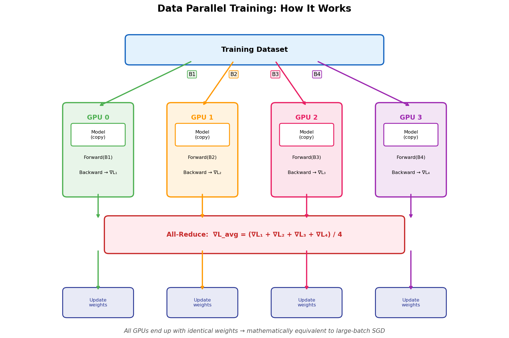
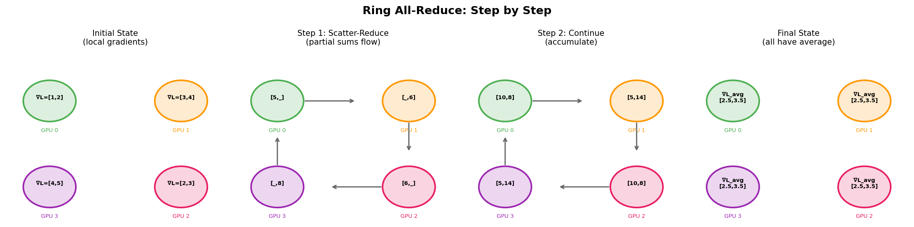
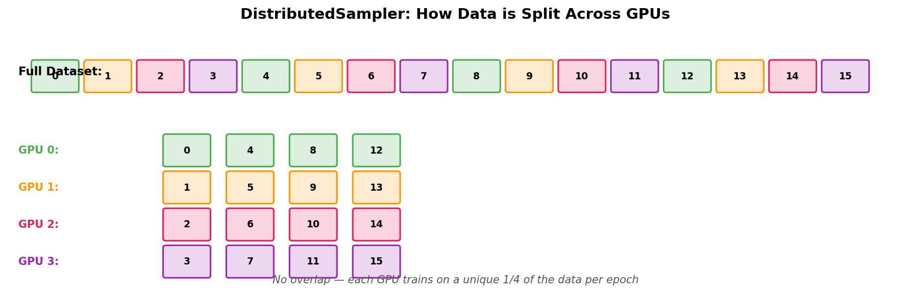
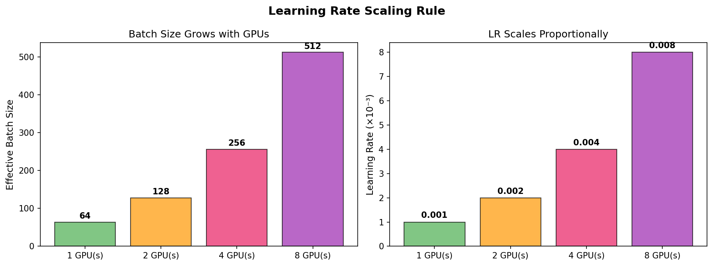
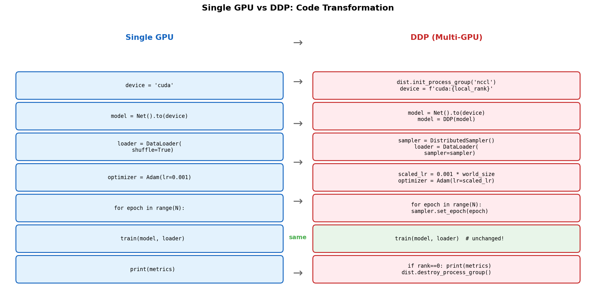
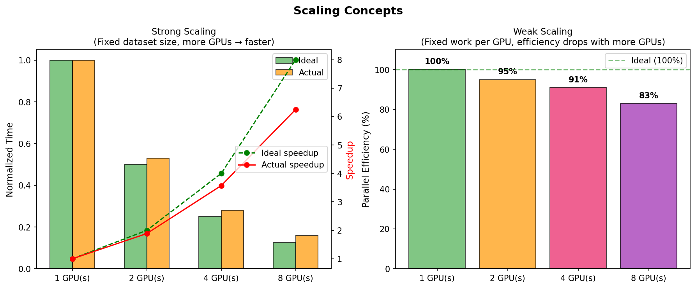
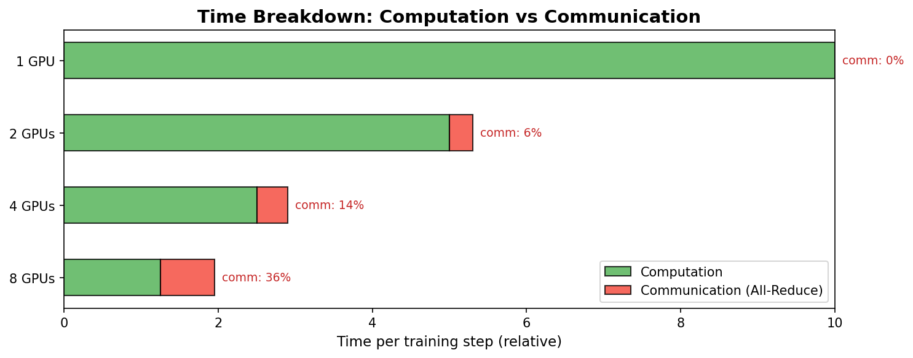
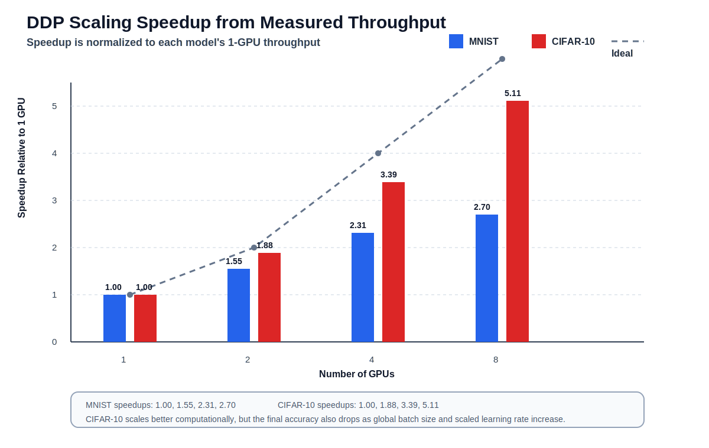

# Distributed Data Parallel (DDP) Training with PyTorch

A hands-on tutorial for scaling deep learning training across multiple GPUs using PyTorch's DistributedDataParallel (DDP).

**System**: ALCF Polaris (NVIDIA A100 GPUs, 4 GPUs per node)

---

## Table of Contents

1. [What is Data Parallelism?](#1-what-is-data-parallelism)
2. [How DDP Works Under the Hood](#2-how-ddp-works-under-the-hood)
3. [Converting Single-GPU Code to DDP](#3-converting-single-gpu-code-to-ddp)
4. [Launching DDP Jobs](#4-launching-ddp-jobs)
5. [Scaling Concepts](#5-scaling-concepts)
6. [Learning Rate Warmup — Why It Matters at Scale](#6-learning-rate-warmup--why-it-matters-at-scale)
7. [Exercises](#7-exercises)
8. [Measured Results from Polaris](#8-measured-results-from-polaris)

---

## 1. What is Data Parallelism?

In data parallelism, we split the **training data** across multiple GPUs while keeping a **copy of the entire model** on each GPU. Every GPU processes a different mini-batch simultaneously, then they synchronize their gradients before updating the model weights.



```
                        ┌─────────────────────────────────────────────┐
                        │           Training Dataset                  │
                        │  ┌─────┬─────┬─────┬─────┬─────┬─────┐    │
                        │  │  B1 │  B2 │  B3 │  B4 │  B5 │ ... │    │
                        │  └──┬──┴──┬──┴──┬──┴──┬──┴─────┴─────┘    │
                        └─────┼─────┼─────┼─────┼────────────────────┘
                              │     │     │     │
                    ┌─────────┘     │     │     └─────────┐
                    │               │     │               │
                    ▼               ▼     ▼               ▼
             ┌────────────┐  ┌────────────┐  ┌────────────┐  ┌────────────┐
             │   GPU 0    │  │   GPU 1    │  │   GPU 2    │  │   GPU 3    │
             │            │  │            │  │            │  │            │
             │ ┌────────┐ │  │ ┌────────┐ │  │ ┌────────┐ │  │ ┌────────┐ │
             │ │ Model  │ │  │ │ Model  │ │  │ │ Model  │ │  │ │ Model  │ │
             │ │ (copy) │ │  │ │ (copy) │ │  │ │ (copy) │ │  │ │ (copy) │ │
             │ └────────┘ │  │ └────────┘ │  │ └────────┘ │  │ └────────┘ │
             │            │  │            │  │            │  │            │
             │  Forward   │  │  Forward   │  │  Forward   │  │  Forward   │
             │  on B1     │  │  on B2     │  │  on B3     │  │  on B4     │
             │            │  │            │  │            │  │            │
             │  Backward  │  │  Backward  │  │  Backward  │  │  Backward  │
             │  ∇L₁       │  │  ∇L₂       │  │  ∇L₃       │  │  ∇L₄       │
             └─────┬──────┘  └─────┬──────┘  └─────┬──────┘  └─────┬──────┘
                   │               │               │               │
                   └───────────────┴───────┬───────┴───────────────┘
                                           │
                                    ┌──────▼──────┐
                                    │  All-Reduce │
                                    │  ∇L_avg =   │
                                    │ (∇L₁ + ∇L₂  │
                                    │+ ∇L₃ + ∇L₄) │
                                    │    / 4       │
                                    └──────┬──────┘
                                           │
                   ┌───────────────┬───────┴───────┬───────────────┐
                   ▼               ▼               ▼               ▼
             ┌────────────┐  ┌────────────┐  ┌────────────┐  ┌────────────┐
             │  Update    │  │  Update    │  │  Update    │  │  Update    │
             │  weights   │  │  weights   │  │  weights   │  │  weights   │
             │  w -= lr * │  │  w -= lr * │  │  w -= lr * │  │  w -= lr * │
             │    ∇L_avg  │  │    ∇L_avg  │  │    ∇L_avg  │  │    ∇L_avg  │
             └────────────┘  └────────────┘  └────────────┘  └────────────┘
```

**Key insight**: Each GPU sees a different slice of data, but after gradient averaging, all GPUs have identical model weights. This is mathematically equivalent to training with a larger batch size on a single GPU.

### Why Not Just Use a Bigger GPU?

| Approach | Pros | Cons |
|----------|------|------|
| Single large GPU | Simple code, no communication | Memory limited, fixed throughput |
| Data Parallel (DDP) | Near-linear speedup, scales to many nodes | Communication overhead, code changes needed |

---

## 2. How DDP Works Under the Hood

### The All-Reduce Operation

The all-reduce is the core communication pattern in DDP. It **sums gradients across all GPUs** and distributes the result back, so every GPU ends up with the same averaged gradient.



```
    Before All-Reduce              Ring All-Reduce              After All-Reduce

    GPU 0: ∇L₀ = [1,2]     ──►   GPU0 ──► GPU1          GPU 0: ∇L_avg = [2.5, 3.5]
    GPU 1: ∇L₁ = [3,4]            ▲         │            GPU 1: ∇L_avg = [2.5, 3.5]
    GPU 2: ∇L₂ = [2,3]            │         ▼            GPU 2: ∇L_avg = [2.5, 3.5]
    GPU 3: ∇L₃ = [4,5]           GPU3 ◄── GPU2           GPU 3: ∇L_avg = [2.5, 3.5]

                              Ring topology:
                              Data flows in a ring,
                              each GPU sends/receives
                              to/from its neighbor
```

PyTorch DDP uses the **NCCL** (NVIDIA Collective Communications Library) backend, which automatically selects the fastest communication path:
- **Within a node**: NVLink (high bandwidth GPU-to-GPU)
- **Across nodes**: Network (InfiniBand / Slingshot)

### DDP Training Loop — Step by Step

```
    ┌─────────────────────────────────────────────────────────────┐
    │                    One Training Step                         │
    ├─────────────────────────────────────────────────────────────┤
    │                                                             │
    │  1. Each GPU loads its own mini-batch from the dataset      │
    │     (DistributedSampler ensures no overlap)                 │
    │                                                             │
    │  2. Forward pass: each GPU computes predictions             │
    │     independently (no communication needed)                 │
    │                                                             │
    │  3. Loss computation: each GPU computes loss on its batch   │
    │                                                             │
    │  4. Backward pass: each GPU computes local gradients        │
    │     *** DDP hooks fire all-reduce during backward ***       │
    │     (overlaps communication with computation!)              │
    │                                                             │
    │  5. Optimizer step: each GPU updates its weights            │
    │     (same averaged gradients → same weights everywhere)     │
    │                                                             │
    └─────────────────────────────────────────────────────────────┘
```

**Important**: DDP overlaps the gradient all-reduce with the backward pass. As soon as gradients for a layer are computed, they start being communicated while the next layer's gradients are still being calculated. This is why DDP is faster than naive approaches.

### Key Terminology

| Term | Meaning | Example (2 nodes, 4 GPUs/node) |
|------|---------|-------------------------------|
| **World size** | Total number of processes (GPUs) | 8 |
| **Rank** | Global process ID (0 to world_size-1) | 0, 1, 2, ..., 7 |
| **Local rank** | GPU index within a node (0 to gpus_per_node-1) | 0, 1, 2, 3 |
| **Node** | A physical machine with multiple GPUs | Node 0, Node 1 |

```
    ┌──────────── Node 0 ────────────┐    ┌──────────── Node 1 ────────────┐
    │                                │    │                                │
    │  GPU 0       GPU 1       GPU 2 │    │  GPU 0       GPU 1       GPU 2 │
    │  rank=0      rank=1      rank=2│    │  rank=4      rank=5      rank=6│
    │  local_rank  local_rank  local │    │  local_rank  local_rank  local │
    │  =0          =1          =2    │    │  =0          =1          =2    │
    │                                │    │                                │
    │        GPU 3                   │    │        GPU 3                   │
    │        rank=3                  │    │        rank=7                  │
    │        local_rank=3            │    │        local_rank=3            │
    │                                │    │                                │
    └────────────────────────────────┘    └────────────────────────────────┘
                        ▲                              ▲
                        └──── High-speed network ──────┘
                              (InfiniBand/Slingshot)
```

---

## 3. Converting Single-GPU Code to DDP

Converting a single-GPU training script to DDP requires **6 changes**. Here is a side-by-side comparison:

### Change 1: Initialize the Process Group

```python
# ──── Single GPU ────                    # ──── DDP ────
                                          import torch.distributed as dist

def main():                               def main():
    device = torch.device("cuda")             # Initialize distributed
                                              dist.init_process_group(backend="nccl")
                                              local_rank = int(os.environ["LOCAL_RANK"])
                                              device = torch.device(f"cuda:{local_rank}")
                                              torch.cuda.set_device(device)
```

**What this does**: Creates a communication group so GPUs can talk to each other. The `nccl` backend is optimized for NVIDIA GPUs.

### Change 2: Wrap the Model with DDP

```python
# ──── Single GPU ────                    # ──── DDP ────
                                          from torch.nn.parallel import DistributedDataParallel as DDP

model = MNISTNet().to(device)             model = MNISTNet().to(device)
                                          model = DDP(model, device_ids=[local_rank])
```

**What this does**: DDP wraps your model and installs hooks on the backward pass to trigger gradient all-reduce automatically. You don't need to change your training loop at all.

### Change 3: Use DistributedSampler

```python
# ──── Single GPU ────                    # ──── DDP ────
                                          from torch.utils.data.distributed import DistributedSampler

train_loader = DataLoader(                sampler = DistributedSampler(train_dataset)
    train_dataset,                        train_loader = DataLoader(
    batch_size=64,                            train_dataset,
    shuffle=True                              batch_size=64,
)                                             shuffle=False,  # sampler handles shuffling
                                              sampler=sampler
                                          )
```

**What this does**: Ensures each GPU gets a **non-overlapping** subset of the data. With 4 GPUs and 60,000 samples, each GPU sees 15,000 samples per epoch.



```
    Dataset: [0, 1, 2, 3, 4, 5, 6, 7, 8, 9, 10, 11, ...]

    DistributedSampler splits it:
        GPU 0: [0, 4, 8, ...]     ← every 4th sample starting at 0
        GPU 1: [1, 5, 9, ...]     ← every 4th sample starting at 1
        GPU 2: [2, 6, 10, ...]    ← every 4th sample starting at 2
        GPU 3: [3, 7, 11, ...]    ← every 4th sample starting at 3

    No overlap! Each GPU trains on 1/4 of the data per epoch.
```

### Change 4: Set Epoch on Sampler

```python
# ──── Single GPU ────                    # ──── DDP ────

for epoch in range(num_epochs):           for epoch in range(num_epochs):
                                              sampler.set_epoch(epoch)  # for proper shuffling
    train(...)                                train(...)
```

**What this does**: Changes the random seed for shuffling each epoch. Without this, every GPU gets the same data order every epoch.

### Change 5: Scale the Learning Rate

```python
# ──── Single GPU ────                    # ──── DDP ────

optimizer = optim.Adam(                   # Linear scaling rule: LR ∝ world_size
    model.parameters(),                   scaled_lr = base_lr * world_size
    lr=0.001                              optimizer = optim.Adam(
)                                             model.parameters(),
                                              lr=scaled_lr
                                          )
```

**What this does**: With N GPUs, the effective batch size is N times larger. To maintain the same training dynamics, scale the learning rate by N. This is known as the **linear scaling rule** (Goyal et al., 2017).

```
    Why scale the learning rate?

    1 GPU:   batch=64,  lr=0.001  →  gradient from 64 samples
    4 GPUs:  batch=64×4, lr=0.001  →  gradient from 256 samples (smoother)
                                       but same lr → undershoot → slow convergence

    Fix:     batch=64×4, lr=0.001×4 = 0.004  →  restores training dynamics

    Rule of thumb:  lr_new = lr_base × world_size
```



### Change 6: Print/Save Only on Rank 0

```python
# ──── Single GPU ────                    # ──── DDP ────
                                          rank = dist.get_rank()

print(f"Loss: {loss}")                    if rank == 0:
torch.save(model, "model.pt")                print(f"Loss: {loss}")
                                              torch.save(model.module.state_dict(), "model.pt")
```

**What this does**: Avoids duplicate output from all GPUs. Note: access `model.module` to get the original model inside the DDP wrapper.



### Complete Transformation Summary

```
    ┌─────────────────────────────┐         ┌─────────────────────────────────┐
    │     Single GPU Script       │         │         DDP Script              │
    ├─────────────────────────────┤         ├─────────────────────────────────┤
    │                             │         │ + import dist, DDP, Sampler     │
    │ device = "cuda"             │   ──►   │ + dist.init_process_group()     │
    │                             │         │ + device = cuda:{local_rank}    │
    │ model = Net().to(device)    │   ──►   │ + model = DDP(model)            │
    │                             │         │                                 │
    │ loader = DataLoader(        │         │ + sampler = DistributedSampler  │
    │   shuffle=True)             │   ──►   │ + loader = DataLoader(          │
    │                             │         │     sampler=sampler)            │
    │ optimizer = Adam(lr=0.001)  │   ──►   │ + lr = 0.001 * world_size      │
    │                             │         │ + optimizer = Adam(lr=scaled)   │
    │ for epoch:                  │         │ for epoch:                      │
    │                             │   ──►   │   + sampler.set_epoch(epoch)    │
    │   train(...)                │         │   train(...)  # unchanged!      │
    │   print(metrics)            │   ──►   │   + if rank==0: print(metrics)  │
    │                             │         │                                 │
    │                             │         │ + dist.destroy_process_group()  │
    └─────────────────────────────┘         └─────────────────────────────────┘

    The training loop itself (forward, loss, backward, step) is UNCHANGED.
    DDP handles gradient synchronization automatically via backward hooks.
```

---

## 4. Launching DDP Jobs

### Single Node (1-4 GPUs on Polaris)

Use `torchrun` which automatically sets `RANK`, `LOCAL_RANK`, and `WORLD_SIZE`:

```bash
# 1 GPU
torchrun --nproc_per_node=1 train_mnist_ddp.py

# 4 GPUs (all GPUs on one Polaris node)
torchrun --nproc_per_node=4 train_mnist_ddp.py
```

### Multi-Node (Polaris with PBS)

On Polaris, multi-node jobs use `mpiexec` with environment variable mapping:

```bash
#!/bin/bash -l
# 2 nodes × 4 GPUs = 8 GPUs total

NNODES=$(cat $PBS_NODEFILE | sort -u | wc -l)
NGPUS_PER_NODE=4
NTOTAL=$((NNODES * NGPUS_PER_NODE))
MASTER_ADDR=$(head -1 $PBS_NODEFILE)

mpiexec -n $NTOTAL --ppn $NGPUS_PER_NODE \
    --hostfile $PBS_NODEFILE \
    --cpu-bind depth --depth 8 \
    bash -c "
        export MASTER_ADDR=$MASTER_ADDR
        export MASTER_PORT=29500
        export WORLD_SIZE=$NTOTAL
        export RANK=\$PMI_RANK
        export LOCAL_RANK=\$PMI_LOCAL_RANK
        python train_mnist_ddp.py
    "
```

```
    ┌──────────────────────────────────────────────────────────┐
    │                    PBS Job (2 nodes)                      │
    │                                                          │
    │  mpiexec launches 8 processes (4 per node):              │
    │                                                          │
    │  Node 0 (MASTER_ADDR)          Node 1                    │
    │  ┌──────────────────┐          ┌──────────────────┐      │
    │  │ P0: RANK=0       │          │ P4: RANK=4       │      │
    │  │     LOCAL_RANK=0  │          │     LOCAL_RANK=0  │      │
    │  │ P1: RANK=1       │          │ P5: RANK=5       │      │
    │  │     LOCAL_RANK=1  │          │     LOCAL_RANK=1  │      │
    │  │ P2: RANK=2       │          │ P6: RANK=6       │      │
    │  │     LOCAL_RANK=2  │          │     LOCAL_RANK=2  │      │
    │  │ P3: RANK=3       │          │ P7: RANK=7       │      │
    │  │     LOCAL_RANK=3  │          │     LOCAL_RANK=3  │      │
    │  └──────────────────┘          └──────────────────┘      │
    │                                                          │
    │  PMI_RANK → RANK       (global rank from MPI)            │
    │  PMI_LOCAL_RANK → LOCAL_RANK  (per-node GPU index)       │
    └──────────────────────────────────────────────────────────┘
```

---

## 5. Scaling Concepts



### Strong Scaling

**Fixed total problem size**, increase the number of GPUs. Each GPU gets fewer samples per epoch.

```
    Strong Scaling (fixed dataset = 60,000 samples)

    GPUs │ Samples/GPU │ Ideal Time │ Actual Time │ Speedup │ Efficiency
    ─────┼─────────────┼────────────┼─────────────┼─────────┼───────────
      1  │   60,000    │    T       │     T       │   1.0x  │   100%
      2  │   30,000    │    T/2     │    ~T/1.9   │  ~1.9x  │   ~95%
      4  │   15,000    │    T/4     │    ~T/3.6   │  ~3.6x  │   ~90%
      8  │    7,500    │    T/8     │    ~T/6.4   │  ~6.4x  │   ~80%

    Speedup = T(1 GPU) / T(N GPUs)
    Efficiency = Speedup / N × 100%
```

**Why efficiency decreases**: Communication overhead becomes a larger fraction of total time as computation per GPU shrinks.

### Weak Scaling

**Fixed samples per GPU**, increase total problem size with more GPUs. The batch size grows with GPUs.

```
    Weak Scaling (fixed 60,000 samples per GPU)

    GPUs │ Total Samples │ Ideal Time │ Actual Time │ Efficiency
    ─────┼───────────────┼────────────┼─────────────┼───────────
      1  │    60,000     │     T      │      T      │   100%
      2  │   120,000     │     T      │     ~T×1.05 │   ~95%
      4  │   240,000     │     T      │     ~T×1.10 │   ~91%
      8  │   480,000     │     T      │     ~T×1.20 │   ~83%

    Efficiency = T(1 GPU) / T(N GPUs) × 100%
```

### Communication vs Computation



```
    Time breakdown per training step:

    1 GPU:  ████████████████████████████████████████  Compute only
            |◄──────── 100% compute ────────────►|

    4 GPUs: ██████████░░░░                          Compute + Comm
            |◄ compute►||◄comm►|
            Each GPU does 1/4 the compute, but adds communication

    Sweet spot: computation time >> communication time
    - Large models → more compute per step → better scaling
    - Small models (like MNIST) → communication dominates → poor scaling
```

---

## 6. Learning Rate Warmup — Why It Matters at Scale

When scaling to many GPUs (e.g., 8 GPUs = 8x LR), the learning rate can become too large for the early stages of training when the model weights are still random. This causes **training instability** — the loss spikes or oscillates instead of decreasing smoothly.

### The Problem

```
    Loss vs Epoch (8 GPUs, MNIST with SGD)

    Loss
     3.0 │ X
         │  X  ← linear_scale: lr=0.08 from epoch 1
     2.5 │   X    loss spikes, training is unstable
         │    X X
     2.0 │       X X
         │ o        X X X     ← may eventually recover, but wastes epochs
     1.5 │  o
         │   o  ← no_scaling: lr=0.01, stable but slow convergence
     1.0 │    o
         │     o o o o o o    ← reaches OK accuracy but far from optimal
     0.5 │
         │ *
     0.3 │  *  ← warmup: lr ramps 0.01→0.08 over 3 epochs
         │   * *
     0.1 │      * * * * *    ← best of both: stable start, fast convergence
         └──────────────────── Epoch
           1  2  3  4  5  6  7  8  9  10
```

### Three LR Strategies

| Strategy | Learning Rate | Behavior |
|----------|--------------|----------|
| **No scaling** | `lr = 0.01` (constant) | Stable but slow — doesn't exploit the parallelism |
| **Linear scale** | `lr = 0.01 × 8 = 0.08` (immediate) | Fast but can diverge early — too aggressive for random weights |
| **Warmup + scale** | `lr: 0.01 → 0.08` over 3 epochs | Best of both — gradual ramp avoids instability |

### The Warmup Schedule

```
    LR
    0.08 │                 ●───●───●───●───●───●───●
         │               /
    0.06 │             /
         │           /     ← linear ramp over warmup_epochs
    0.04 │         /
         │       /
    0.02 │     /
         │   /
    0.01 │ ●
         └──────────────────────────────────── Epoch
           1   2   3   4   5   6   7   8   9  10
               └─warmup─┘  └── full lr ──────────┘
```

### Running the Warmup Study

```bash
# On 8 GPUs (2 nodes), compare all three strategies
torchrun --nproc_per_node=4 train_mnist_warmup_study.py --epochs 10 --base-lr 0.01

# Or with mpiexec for multi-node
mpiexec -n 8 --ppn 4 ... python train_mnist_warmup_study.py --epochs 10 --base-lr 0.01
```

Results are saved to `results/warmup_study.csv`.

---

## 7. Exercises

### Exercise 1: Run the Scaling Tests

The `run_scaling.sh` script runs MNIST and CIFAR-10 across 1, 2, 4, and 8 GPUs:

```bash
# Submit via ClearML or run interactively on compute nodes
bash run_scaling.sh
```

Results are saved to `results/scaling_results.csv`.

### Exercise 2: Analyze the Results

After the scaling tests complete, answer these questions:
1. What is the speedup going from 1 to 4 GPUs? From 1 to 8 GPUs?
2. Is the scaling sub-linear? Why?
3. Which model (MNIST CNN vs CIFAR-10 CNN) scales better? Why?
4. At what point does adding more GPUs stop being beneficial?

### Exercise 3: Experiment with Batch Size

Modify the training scripts to try different per-GPU batch sizes:
- Does a larger batch size improve scaling efficiency?
- What happens to convergence (final accuracy) with very large effective batch sizes?

### Exercise 4: Profile Communication

Add `NCCL_DEBUG=INFO` to your environment and observe:
- Which communication algorithm does NCCL choose? (Ring? Tree?)
- How much time is spent in communication vs computation?

```bash
export NCCL_DEBUG=INFO
torchrun --nproc_per_node=4 train_mnist_ddp.py
```

---

## Files in This Directory

| File | Description |
|------|-------------|
| `train_mnist_ddp.py` | MNIST training with DDP (lines marked `#DDP`) |
| `train_cifar10_ddp.py` | CIFAR-10 training with DDP (lines marked `#DDP`) |
| `run_scaling.sh` | Scaling test launcher (1, 2, 4, 8 GPUs) |
| `figures/` | Schematic diagrams (PNG) |
| `results/` | Scaling test results (CSV + report) |

---

## Further Reading

- [PyTorch DDP Tutorial](https://pytorch.org/tutorials/intermediate/ddp_tutorial.html)
- [PyTorch Distributed Overview](https://pytorch.org/docs/stable/distributed.html)
- [NCCL Documentation](https://docs.nvidia.com/deeplearning/nccl/)
- [Polaris User Guide](https://docs.alcf.anl.gov/polaris/getting-started/)

---

## 8. Measured Results from Polaris

The following measurements were collected for the two DDP examples in this
folder on Polaris using `1`, `2`, `4`, and `8` GPUs.

### Raw Results

| Model | GPUs | Batch/GPU | Global Batch | Base LR | Scaled LR | Avg Epoch Time (s) | Throughput (samples/s) | Total Time (s) | Final Accuracy (%) |
|----------|----:|----------:|-------------:|--------:|----------:|-------------------:|-----------------------:|---------------:|-------------------:|
| MNIST | 1 | 64 | 64 | 0.001 | 0.001 | 2.343 | 25604.1 | 14.147 | 99.3 |
| MNIST | 2 | 64 | 128 | 0.001 | 0.002 | 1.516 | 39566.8 | 10.079 | 98.9 |
| MNIST | 4 | 64 | 256 | 0.001 | 0.004 | 1.014 | 59185.3 | 7.887 | 98.8 |
| MNIST | 8 | 64 | 512 | 0.001 | 0.008 | 0.870 | 69004.1 | 6.762 | 98.6 |
| CIFAR-10 | 1 | 128 | 128 | 0.1 | 0.1 | 5.264 | 9498.4 | 58.491 | 78.6 |
| CIFAR-10 | 2 | 128 | 256 | 0.1 | 0.2 | 2.794 | 17896.0 | 33.836 | 79.8 |
| CIFAR-10 | 4 | 128 | 512 | 0.1 | 0.4 | 1.552 | 32224.1 | 21.600 | 69.7 |
| CIFAR-10 | 8 | 128 | 1024 | 0.1 | 0.8 | 1.029 | 48571.5 | 16.137 | 43.2 |

### Throughput-Based Speedup

The plot below shows speedup relative to the `1`-GPU throughput for each
model.



### Interpretation

- `MNIST` scales, but only modestly. The model is small enough that
  communication and launch overhead start to matter quickly.
- `CIFAR-10` scales better in throughput because each step has more compute to
  amortize the cost of gradient synchronization.
- `MNIST` accuracy remains fairly stable from `99.3%` to `98.6%`.
- `CIFAR-10` accuracy drops sharply at large GPU counts because the experiment
  also increases the global batch size and scaled learning rate.

### Talking Point for Class

These results show that distributed training has two separate questions:

1. How well does the system scale in runtime and throughput?
2. Does the optimization still behave well as batch size and learning rate
   change?

That distinction is especially visible here:

- `CIFAR-10` scales better computationally than `MNIST`
- but `CIFAR-10` also becomes much less accurate at the largest scale

This makes the results useful for discussing both HPC performance and machine
learning optimization.
