# Deep Learning Tutorials

**CSCI 394 -- Spring 2026**

This directory contains hands-on tutorials that progressively introduce
deep learning using PyTorch. Each tutorial is available as a Jupyter notebook
(for Google Colab) and, where applicable, a standalone Python script.

| # | Tutorial | Notebook | Script |
| - | -------- | -------- | ------ |
| 1 | MNIST with Fully Connected Network | `01_mnist_deep_learning.ipynb` | `01_mnist_deep_learning.py` |
| 2 | CIFAR-10 with Fully Connected Network | `02_cifar10_deep_learning.ipynb` | `02_cifar10_deep_learning.py` |
| 3 | CIFAR-10 with CNN | `03_cifar10_cnn.ipynb` | `03_cifar10_cnn.py` |
| 4 | Large Language Models (LLMs) | `04_large_language_models.ipynb` | -- |

Training results and comparison plots are in `figures/` and summarized in
`report.md`.

---

## 1. What is Deep Learning?

Deep learning is a subset of machine learning that uses **neural networks**
with multiple layers to learn representations of data. Instead of manually
designing features (e.g., edge detectors, color histograms), the network
learns the right features directly from raw data.

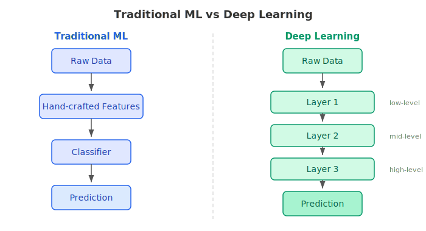

### Why "deep"?

The term refers to the **depth** of the network -- the number of layers
between input and output. Deeper networks can learn more abstract,
hierarchical representations.

---

## 2. The Artificial Neuron

Every neural network is built from **neurons** (also called units or nodes).
A single neuron computes a weighted sum of its inputs, adds a bias, and
passes the result through an **activation function**:

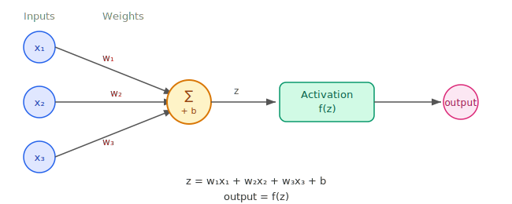

### Common Activation Functions

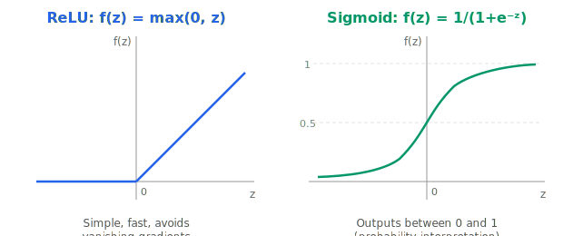

**ReLU** (Rectified Linear Unit) is the most widely used activation function
in modern deep learning because it is simple, fast, and avoids the
vanishing gradient problem.

---

## 3. Fully Connected (Dense) Layers

In a **fully connected** (FC) layer, every neuron in one layer is connected
to every neuron in the next layer. This is also called a "dense" layer.

### Architecture for MNIST (Tutorial 1)

MNIST images are 28x28 = 784 pixels. We flatten them into a vector and
pass through FC layers:

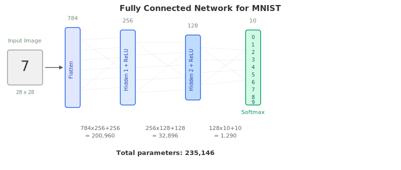

Each arrow represents a **learnable weight**. The total number of parameters
in a layer is: `(input_size x output_size) + output_size` (weights + biases).

### How Prediction Works

The output layer has 10 neurons (one per digit). The **softmax** function
converts the raw outputs (logits) into probabilities:

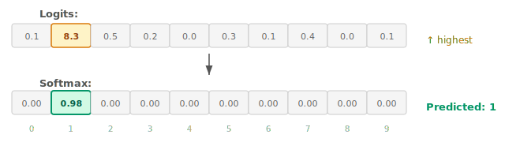

---

## 4. How Neural Networks Learn

Training a neural network involves four steps repeated over many iterations:

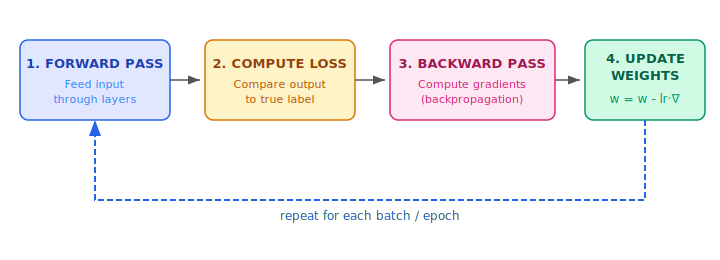

### Step-by-step

1. **Forward pass**: Input flows through each layer, producing a prediction.

2. **Loss computation**: A loss function measures how wrong the prediction is.
   - For classification: **Cross-Entropy Loss**
   - For regression: **Mean Squared Error (MSE)**

3. **Backpropagation**: Using the chain rule of calculus, compute how much
   each weight contributed to the error (the gradient).

4. **Weight update**: Adjust each weight in the direction that reduces the
   loss, scaled by a **learning rate** (lr).

### Key Terminology

| Term | Definition |
| ---- | ---------- |
| **Epoch** | One complete pass through the entire training dataset |
| **Batch** | A subset of training samples processed together |
| **Batch size** | Number of samples in one batch (e.g., 128) |
| **Iteration** | One weight update (= one batch processed) |

> **Example:** 60,000 samples, batch size 128 -> 469 iterations per epoch

### Loss Landscape (Conceptual)

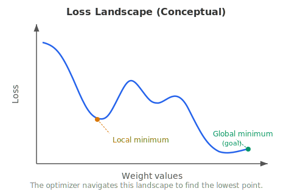

---

## 5. Convolutional Neural Networks (CNNs)

### The Problem with FC Networks for Images

Fully connected networks have fundamental limitations for image data:

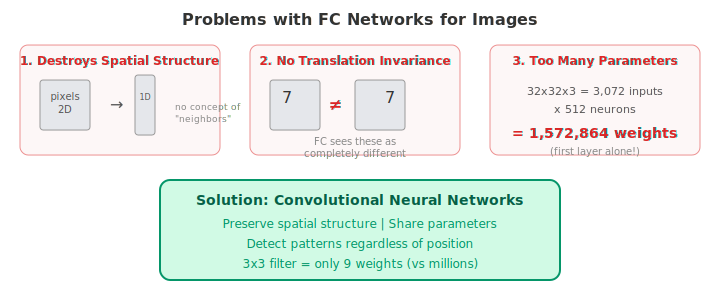

### The Convolution Operation

A **convolution** slides a small filter (kernel) across the image, computing
a dot product at each position. This detects **local patterns** like edges.

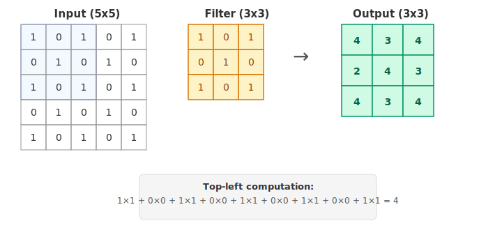

### Key Properties of Convolutions

**Parameter sharing**: The same 3x3 filter (9 weights) is applied at
every spatial position. Compare this to FC where each position has its
own set of weights.

| Layer Type | Computation | Weights |
| ---------- | ----------- | ------- |
| FC layer (5x5 -> 3x3) | 5\*5 \* 3\*3 | 225 weights |
| Conv layer (3x3 filter) | 3\*3 | 9 weights (25x fewer!) |

**Translation invariance**: Since the same filter scans everywhere, a
pattern is detected regardless of where it appears in the image.

### Max Pooling

**Max pooling** reduces the spatial dimensions by taking the maximum value
in each non-overlapping patch:

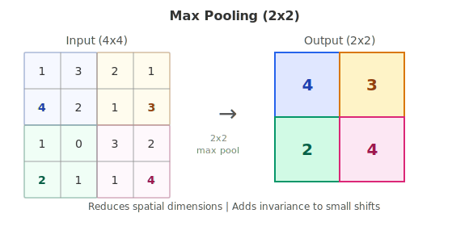

Pooling serves two purposes:
- **Reduces computation** by shrinking feature maps
- **Adds invariance** to small spatial shifts

### Batch Normalization

Normalizes activations within each mini-batch to have zero mean and unit
variance per channel. This stabilizes training and allows higher learning
rates.

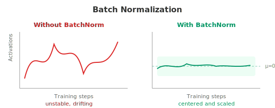

### CNN Architecture (Tutorial 3)

Our CIFAR-10 CNN has three convolutional blocks followed by a classifier:

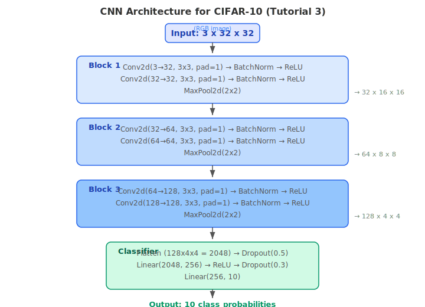

### What Each Layer Learns

As data flows through the CNN, each block extracts increasingly abstract features:

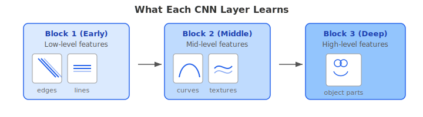

---

## 6. FC vs CNN: Side-by-Side Comparison

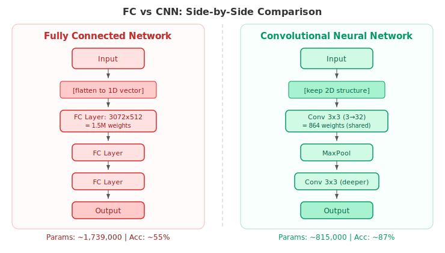

### Why CNNs Win

| Property | FC Network | CNN |
| -------- | ---------- | --- |
| Spatial structure | Destroyed by flattening | Preserved by 2D convolutions |
| Parameter sharing | None (unique weights per position) | Same filter applied everywhere |
| Translation invariance | None | Built-in via convolution + pooling |
| Parameter count | Grows with image size squared | Independent of image size |
| Hierarchical features | Flat (single transformation) | Edges -> Textures -> Objects |

---

## 7. Training Techniques

### Data Augmentation

Artificially expand the training set by applying random transformations:

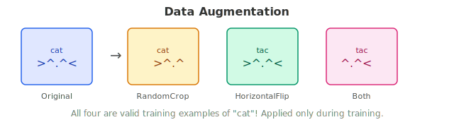

Important: augmentation is applied **only during training**, not during testing.

### Learning Rate Scheduling

Start with a larger learning rate for fast progress, then reduce it for
fine-tuning:

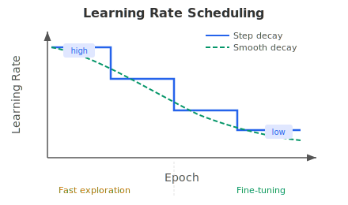

### Dropout

Randomly disable neurons during training to prevent overfitting:

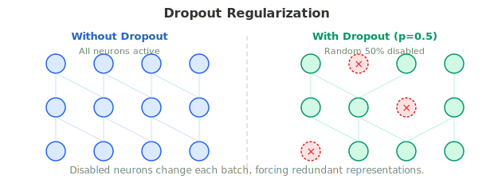

This forces the network to develop redundant representations and not
rely on any single neuron.

---

## 8. Running the Tutorials

### On Google Colab (Recommended for beginners)

1. Upload a notebook (`.ipynb`) to [Google Colab](https://colab.research.google.com/)
2. Set runtime to GPU: `Runtime > Change runtime type > GPU`
3. Run all cells: `Runtime > Run all`

### Locally with Python

```bash
# Install dependencies
pip install torch torchvision matplotlib

# Run each experiment
python 01_mnist_deep_learning.py
python 02_cifar10_deep_learning.py
python 03_cifar10_cnn.py

# Generate comparison report
python generate_report.py
```

Results are saved to `figures/` (plots) and JSON files (metrics).

---

## 9. Results Summary

| Experiment | Model | Parameters | Best Test Accuracy | Training Time |
| ---------- | ----- | ---------- | ------------------ | ------------- |
| MNIST FC | FC(784->256->128->10) | 235K | 98.1% | 50s |
| CIFAR-10 FC | FC(3072->512->256->128->10) | 1,739K | 55.0% | 138s |
| CIFAR-10 CNN | 6-conv + FC head | 815K | 86.9% | 329s |

See `report.md` for the full report with plots and per-class breakdowns.
