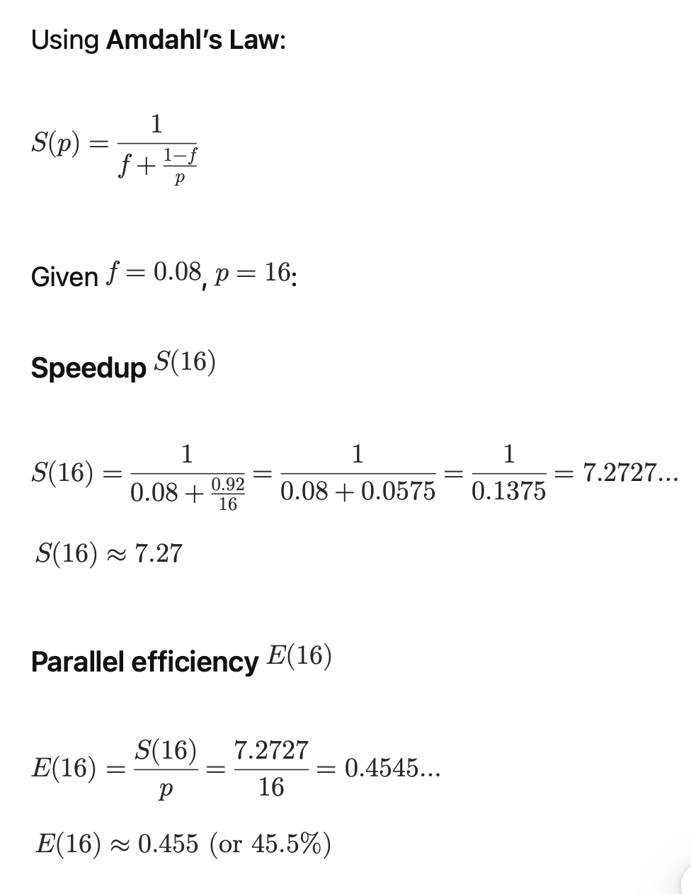

Dated: Feb 7, 2026

# Multiple Choice (8 questions, 8 pts each) - Please highlight the correct answer

1.  Which is the slide’s definition of **architecture in HPC**?

> A. The physical layout of racks and cables
>
> B. The organization and functionality of constituent components and the logical ISA presented to programs
>
> C. The programming model used by applications
>
> D. The performance ranking of the system

2.  In HPC, “performance” is generally measured as:  
    > A. Peak clock frequency B. Work accomplished per unit time  
    > C. Number of nodes in the cluster D. Size of RAM per node

3.  Which best describes **Peak FLOPS** vs **Sustained FLOPS**?  
    > A. Peak is measured on real apps; sustained is theoretical  
    > B. Peak is theoretical maximum; sustained is what apps achieve  
    > C. Both are identical if MPI is used  
    > D. Sustained is always higher than peak

4.  Which is **NOT** listed in the SLOWER performance model?  
    > A. Starvation B. Latency C. Overhead D. Accuracy

5.  Which is a **throughput metric**?  
    > A. Wall-clock time B. FLOPS C. Cache miss rate D. Serial fraction

6.  **Strong scaling** means:  
    > A. Problem size increases with core count  
    > B. Execution time decreases as you add processors for a fixed problem size  
    > C. Execution time stays constant as you add processors for a fixed problem size  
    > D. Only GPU count increases, not CPU

7.  **Weak scaling** means:  
    > A. Fixed total problem size, more processors  
    > B. Problem size grows with core count, aiming for constant time  
    > C. Time must decrease linearly with processors  
    > D. Only applies to I/O benchmarks

8.  HPL (High Performance LINPACK) primarily measures performance on:  
    > A. Sparse matrix-vector multiply B. Dense linear system solve (Ax=b)  
    > C. File metadata operations D. MPI ping-pong latency only

# Short answer (2 questions, 18 pts each)

1.  Assume a CPU-only HPC system has 8192 nodes. Each compute node has:

- 2 CPU sockets

- Each CPU has 64 cores

- CPU frequency = 2.5 GHz

- Each core can do 32 FLOPs per cycle

> **(1)** Compute the system’s **theoretical peak performance** (in FLOP/s, and report the result in **PFLOP/s: 1 PFLOP/s = 10^15 FLOPs**).
>
> **(2)** Name **two reasons** why sustained FLOP/s is usually lower than theoretical peak FLOP/s.

2\*64\*2.5 \* 32 = 10240 GFLOPs per node

Full system: 8192 \* 10240 = 83,886080 GFLOPS = 83.89 Peta Flops

Communication overhead, memory bandwidth bottleneck, and

2.  A program has a **serial fraction** f = 0.08 (8%). The rest is perfectly parallel. If you run it on p = 16 cores,

<!-- -->

1)  Compute the **speedup** S(16) and **parallel efficiency** E(16).

2)  What is the **maximum possible speedup** as p -\> infinity

